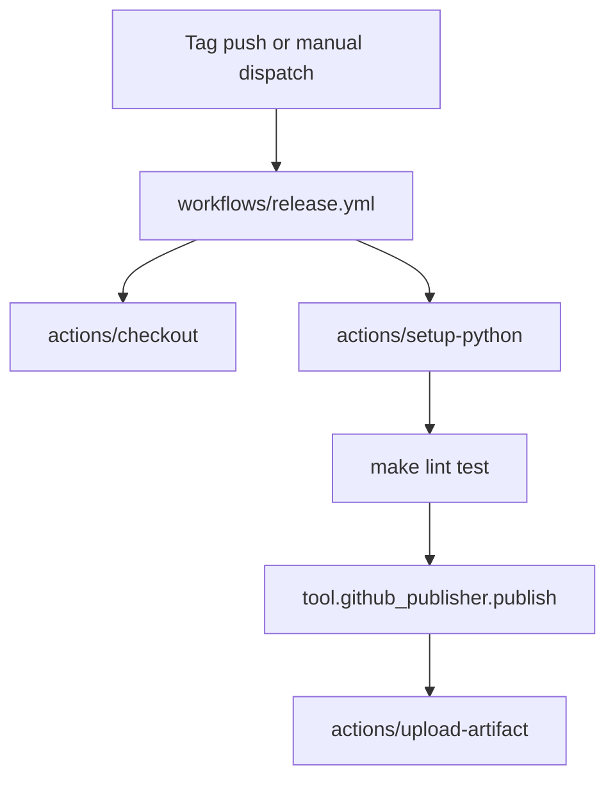

# GitHub Configuration

Project automation lives under `.github`. Workflows publish releases and enforce quality gates based on the portable profile lifecycle.

Refer to `.github/workflows/README.md` for step-by-step explanations of each job.
