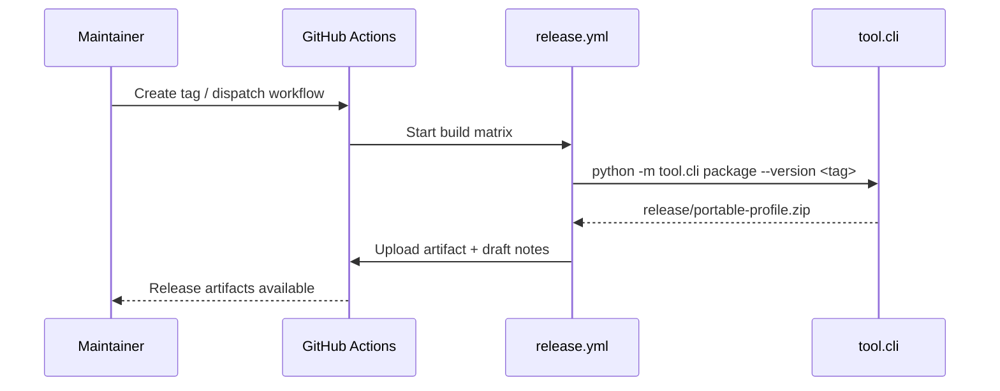

# CI/CD Workflows

The repository currently ships a single workflow, `release.yml`, which packages artifacts and prepares a GitHub release. Future automations should document their behavior here.

Key stages:

1. **Build** — installs dependencies, runs Ruff, mypy, and pytest.
2. **Package** — invokes the CLI to generate the release bundle and JSON descriptor.
3. **Publish** — uploads artifacts for manual verification before pushing tags.
