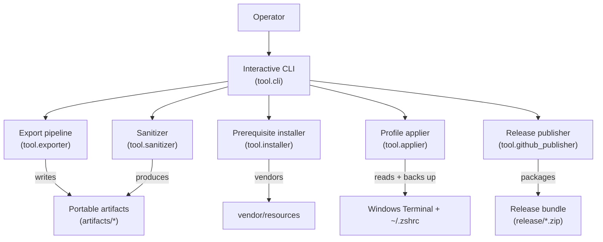
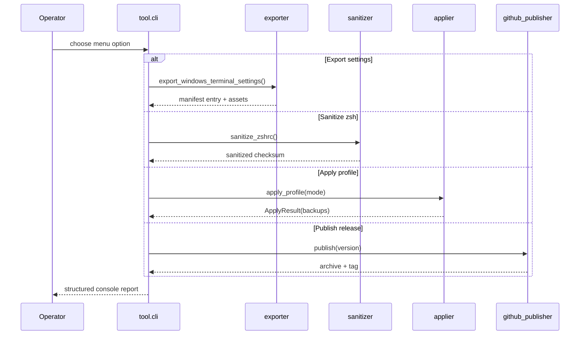
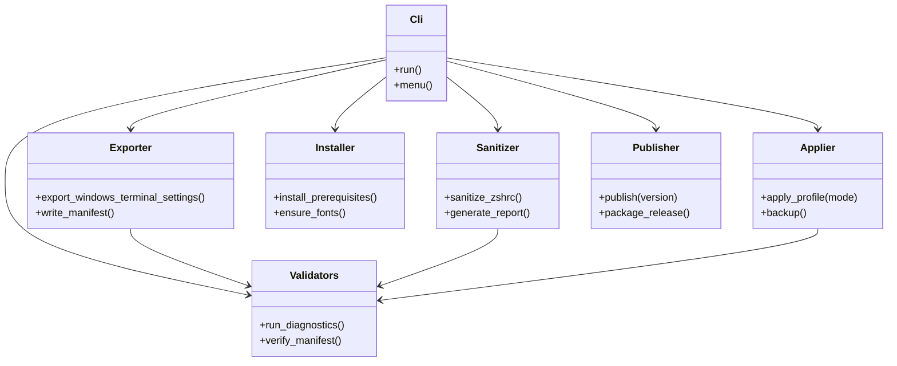
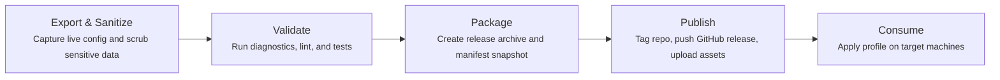
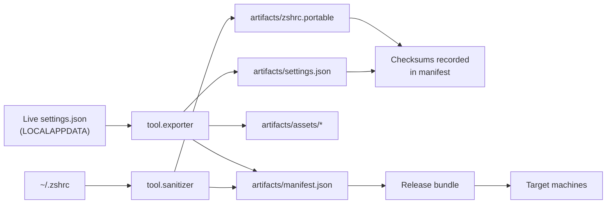

# Windows Terminal Portable Profile

> A reproducible, privacy-conscious toolkit for exporting your Windows Terminal experience, sanitizing personal data, and reinstalling it anywhere through a single Typer-powered CLI.

## Table of Contents

1. [Why This Exists](#why-this-exists)
2. [Feature Highlights](#feature-highlights)
3. [Supported Platforms](#supported-platforms)
4. [Installation](#installation)
5. [Quick Start](#quick-start)
6. [How It Works](#how-it-works)
7. [Architecture Visuals](#architecture-visuals)
8. [Directory Reference](#directory-reference)
9. [CLI Surface](#cli-surface)
10. [Artifact Pipeline](#artifact-pipeline)
11. [Publishing &amp; Automation](#publishing--automation)
12. [Validation &amp; Testing](#validation--testing)
13. [Troubleshooting](#troubleshooting)
14. [Contributing](#contributing)
15. [License](#license)

## Why This Exists

Windows Terminal personalizations are often locked to a single machine. This project:

- Captures the full terminal experience (settings, backgrounds, fonts, shell profile).
- Scrubs secrets, machine identifiers, and offensive tooling before distribution.
- Packages the sanitized bundle with deterministic manifests so others can apply it safely.
- Publishes releases to GitHub so you can share or re-import the same experience later.

## Feature Highlights

- **End-to-end workflow**: export, sanitize, install prerequisites, apply profiles, and publish releases from one menu.
- **Deterministic sanitization**: configurable allowlists and denylists keep useful customizations while stripping secrets, emails, tokens, and absolute paths.
- **Auditable artifacts**: every generated file is hashed and logged inside `artifacts/manifest.json` for integrity checks.
- **Guard rails by default**: automatic backups, dry-run safeguards, and explicit prompts protect production shells.
- **Visual documentation**: every directory ships with a README and Mermaid diagrams mirroring the CLI flow.

## Supported Platforms

- Windows 11 (PowerShell 5.1+, Windows Terminal 1.19+).
- Windows Subsystem for Linux (Ubuntu 22.04+ recommended).
- macOS or Linux consumers can apply the sanitized bundle if Windows-specific steps are skipped.

## Installation

### Prerequisites

- Python 3.11 or newer (`py -3.11 --version` on Windows, `python3 --version` in WSL).
- Git 2.45+.
- Optional: `make`, `pipx`, and `winget` for scripted installs.

### Clone and Set Up

```powershell
cd $env:USERPROFILE\Documents
git clone https://github.com/runndownn/windows-terminal-portable-profile.git
cd windows-terminal-portable-profile
py -3.11 -m venv .venv
.venv\Scripts\Activate.ps1
pip install --upgrade pip
pip install -r requirements.txt
```

WSL users can run the equivalent:

```bash
git clone https://github.com/runndownn/windows-terminal-portable-profile.git
cd windows-terminal-portable-profile
python3 -m venv .venv
source .venv/bin/activate
pip install --upgrade pip
pip install -r requirements.txt
```

### Optional Toolchain

```powershell
make bootstrap   # installs pre-commit hooks, lint tools, pytest plugins
make lint        # runs ruff, mypy, bandit
make test        # executes pytest with coverage
```

## Quick Start

```powershell
python -m tool.cli --menu
```

The menu walks through:

1. Exporting your current Windows Terminal `settings.json` and assets.
2. Sanitizing your `.zshrc` and manifesting the changes.
3. Installing prerequisites (Windows Terminal, WSL, Oh My Zsh, Nerd Fonts).
4. Applying the sanitized profile in default, copy, or promote mode.
5. Packaging and publishing a release-ready archive.

Scripted automation without the menu:

```powershell
python -m tool.cli export
python -m tool.cli sanitize
python -m tool.cli apply --mode default
```

## How It Works

1. **Collect**: `tool.exporter` snapshots Windows Terminal JSON, fonts, and background assets.
2. **Sanitize**: `tool.sanitizer` strips secrets, normalizes aliases, and rebuilds a portable `.zshrc`.
3. **Install**: `tool.installer` ensures upstream dependencies exist (winget, apt, fonts, Oh My Zsh).
4. **Apply**: `tool.applier` writes sanitized artifacts to the destination with timestamped backups.
5. **Validate**: `tool.validators` checks hashes, git status, and environment drift.
6. **Publish**: `tool.github_publisher` signs, zips, and optionally pushes a tagged GitHub release.

## Architecture Visuals

### Runtime Flow



### CLI Interaction Sequence



### Module Relationships



### Release Timeline



## Directory Reference

| Path                                            | README                                                   | Purpose                                                                              |
| ----------------------------------------------- | -------------------------------------------------------- | ------------------------------------------------------------------------------------ |
| `README.md`                                   | This file                                                | Repository overview, install, usage, visuals.                                        |
| `artifacts/`                                  | `artifacts/README.md`                                  | Generated payloads (`settings.json`, `zshrc.portable`, manifest, assets, fonts). |
| `docs/`                                       | `docs/README.md` (see `DIAGRAMS.md`, `USAGE.md`)   | Deep-dive guides, diagrams, sanitization report.                                     |
| `scripts/`                                    | `scripts/README.md`                                    | PowerShell and shell helpers for automation.                                         |
| `tests/`                                      | `tests/README.md`                                      | Pytest layout, fixtures, coverage expectations.                                      |
| `tmp/`                                        | `tmp/README.md`                                        | Ephemeral workspace for diagnostics and scratch exports.                             |
| `tool/`                                       | `tool/README.md`                                       | CLI module documentation, entry points, dependency graph.                            |
| `vendor/`                                     | `vendor/README.md`                                     | Vendored fonts, Oh My Zsh plugins, license notices.                                  |
| `windows_terminal_portable_profile.egg-info/` | `windows_terminal_portable_profile.egg-info/README.md` | Packaging metadata and distribution provenance.                                      |

## CLI Surface

| Command                                                  | Function                                           | Summary                                                                            |
| -------------------------------------------------------- | -------------------------------------------------- | ---------------------------------------------------------------------------------- |
| `python -m tool.cli --menu`                            | `tool.cli.menu`                                  | Launches interactive menu covering every workflow.                                 |
| `python -m tool.cli export`                            | `tool.exporter.export_windows_terminal_settings` | Exports Windows Terminal settings, assets, and updates manifest.                   |
| `python -m tool.cli sanitize`                          | `tool.sanitizer.sanitize_zshrc`                  | Produces a portable `.zshrc`, regenerates sanitization report, updates manifest. |
| `python -m tool.cli install`                           | `tool.installer.install_prerequisites`           | Installs Windows Terminal, WSL, Oh My Zsh, and fonts as needed.                    |
| `python -m tool.cli apply --mode default\|copy\|promote` | `tool.applier.apply_profile`                     | Applies sanitized artifacts with timestamped backups and optional dry run.         |
| `python -m tool.cli package`                           | `tool.github_publisher.publish`                  | Zips artifacts, prepares release metadata, publishes when configured.              |
| `python -m tool.cli diagnostics`                       | `tool.validators.run_diagnostics`                | Validates manifest hashes, git status, and environment readiness.                  |

## Artifact Pipeline

- `settings.json` — sanitized Windows Terminal configuration harvested by `tool.exporter`.
- `zshrc.portable` — cleaned `.zshrc` produced by `tool.sanitizer`.
- `manifest.json` — authoritative list of shipped files and SHA-256 checksums.
- `assets/` — icons and images copied from local references.
- `fonts/` — optional Nerd Fonts bundled for offline use.



Integrity guarantees:

- Files are rewritten atomically with UTF-8 encoding.
- Every regeneration updates `manifest.json` with fresh hashes.
- Downstream scripts read only from `artifacts/`; they never mutate live profiles.

## Publishing & Automation

- Configure `GITHUB_TOKEN` or `GH_TOKEN` with repo scope to enable release publishing.
- `tool.github_publisher.publish` reads `pyproject.toml` for versioning; bump the version before packaging.
- CI-ready steps:
  1. `python -m tool.cli export`
  2. `python -m tool.cli sanitize`
  3. `python -m tool.cli diagnostics`
  4. `python -m tool.cli package`
- See `.github/workflows/release.yml` for GitHub Actions automation.

## Validation & Testing

- `pytest` runs under `tests/` with fixtures that stub Windows APIs during CI.
- `make test` executes pytest with coverage and writes reports under `tmp/pytest`.
- `ruff`, `mypy`, and `bandit` keep code quality in check (`make lint`).
- `python -m tool.cli diagnostics` confirms manifests are synchronized before publishing.

## Troubleshooting

- **Winget not found**: install the [App Installer](https://apps.microsoft.com/detail/9nblggh4nns1) package or run `python -m tool.cli install --skip-winget`.
- **WSL not enabled**: run `scripts/install_wsl.sh` from an elevated PowerShell session, reboot, then retry.
- **Fonts missing after apply**: rerun `python -m tool.cli install` to vendor fonts and reapply with `--mode promote`.
- **Manifest drift**: delete `artifacts/manifest.json` and re-run `export` + `sanitize` to regenerate hashes.
- **Dry run**: append `--dry-run` to `apply` to preview changes without touching live files.

## Contributing

1. Fork the repository and create a feature branch (e.g., `feat/new-sanitizer-rule`).
2. Install the dev toolchain with `make bootstrap`.
3. Run `make lint test` and ensure `python -m tool.cli diagnostics` passes before opening a PR.
4. Update relevant directory READMEs and the sanitization report when behavior changes.

## License

This project is released under the MIT License. Vendored components (Oh My Zsh, plugins, fonts) retain their upstream licenses; see `vendor/` for details.
