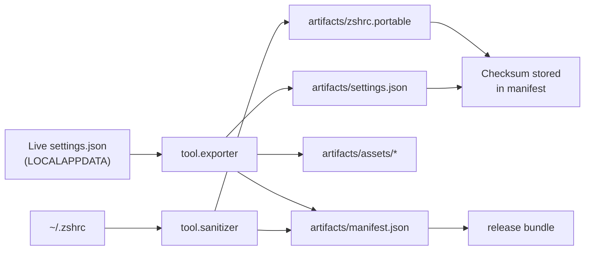

# Portable Artifacts

The `artifacts` directory caches everything needed to recreate a Windows Terminal experience on a new host. Files are generated, never handwritten, and tracked with hashes so consumers can verify provenance.

## Contents

- `settings.json` — sanitized Windows Terminal configuration harvested by `tool.exporter`.
- `zshrc.portable` — cleaned `.zshrc` produced by `tool.sanitizer`.
- `manifest.json` — authoritative list of shipped files and SHA-256 checksums.
- `assets/` — icons and images copied from local references.
- `fonts/` — optional Nerd Fonts bundled for offline use.

## Integrity Guarantees

1. Files are rewritten atomically with UTF-8 encoding.
2. Every regeneration updates `manifest.json` with fresh hashes.
3. Downstream scripts read only from this directory; they never mutate live profiles.

## Code-Level Responsibilities

- `tool.exporter.export_windows_terminal_settings` orchestrates the export flow by reading the live `settings.json`, passing the payload through `sanitize_settings`, cloning assets via `copy_assets`, and writing the result with `_write_settings`.
- `tool.sanitizer.sanitize_zshrc` applies regex-based rules (`RULES`) and alias filters (`DENYLIST_ALIASES`), produces the portable `.zshrc`, and records the operation in both the manifest and `docs/SANITIZATION_REPORT.md`.
- `tool.applier._apply_settings` and `_apply_zsh` consume this directory during `apply_profile`, ensuring backups exist before touching the live environment.
- `tool.github_publisher.publish` includes `artifacts/` in the release archive, so every checksum baked into the manifest is available to downstream consumers.

## Verifying Artifact Health

1. Run `python -m tool.cli export` followed by `python -m tool.cli sanitize`.
2. Inspect `artifacts/manifest.json` to confirm both `settings.json` and `zshrc.portable` entries contain the current timestamp and SHA-256 values.
3. Execute `python -m tool.cli diagnostics` to ensure the manifest references match on-disk files.
4. Optionally compute `Get-FileHash artifacts\settings.json -Algorithm SHA256` to cross-check recorded hashes.
