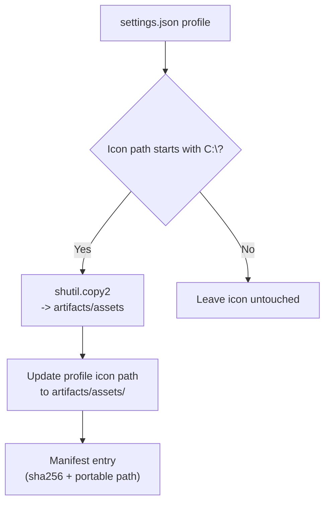

# Assets Cache

Any icon referenced in the exported Windows Terminal settings is copied into this directory so profiles remain portable even when the original path was local.

- The copying logic lives in `tool.exporter.copy_assets`. For each profile in the exported `settings.json`, the function inspects the `icon` field, verifies that it is a Windows filesystem path, and uses `shutil.copy2` to clone the file into `artifacts/assets`.
- `tool.exporter.sanitize_settings` normalizes the `icon` reference to a relative `artifacts/assets/<name>` string so downstream systems do not need absolute Windows paths.
- `tool.exporter.update_manifest` appends or refreshes the icon entry inside `artifacts/manifest.json`, including the SHA-256 checksum produced by `_hash_file`.
- Files are safe to delete; the exporter will repopulate them on the next run.
- Non-Windows paths (e.g., packaged URIs) bypass the copy step and stay inline so Microsoft Store assets remain untouched.

## What to Check When Icons Fail

1. Ensure `settings.json` still references the icon (look for the profile's `icon` property).
2. Confirm the original icon file exists and is readable before running the exporter.
3. Re-run `python -m tool.cli export` to rebuild artifacts and manifest entries.
4. Validate that the manifest contains the updated checksum for the asset.
