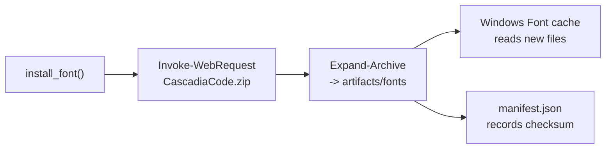

# Fonts Bundle

This directory holds optional Nerd Font archives installed by `tool.installer.install_font`. Keeping fonts beside the profile ensures consistent glyph coverage on disconnected systems and prevents `install_prerequisites` from re-downloading the same archive.

- `install_font` streams the ZIP to disk using PowerShell's `Invoke-WebRequest`, extracts it into `artifacts/fonts`, and then relies on Windows font registration to pick up the new files.
- `tool.github_publisher.build_release_manifest` packages this directory so offline hosts have the same glyph set as the maintainer's environment.
- Delete stale fonts before re-running `install_font()` if you need to refresh versions.
- The exporter never reads this folder; it strictly feeds the installer and release packager.

## Maintenance Tips

1. When upgrading fonts, remove the old archive from `artifacts/fonts` to avoid duplicate ZIPs.
2. Re-run `python -m tool.cli export` afterward so the manifest checksum reflects the new font payload.
3. If the Windows font cache does not refresh automatically, log out or run `Get-ChildItem "C:\Windows\Fonts" | Out-Null` to prompt rescan.
