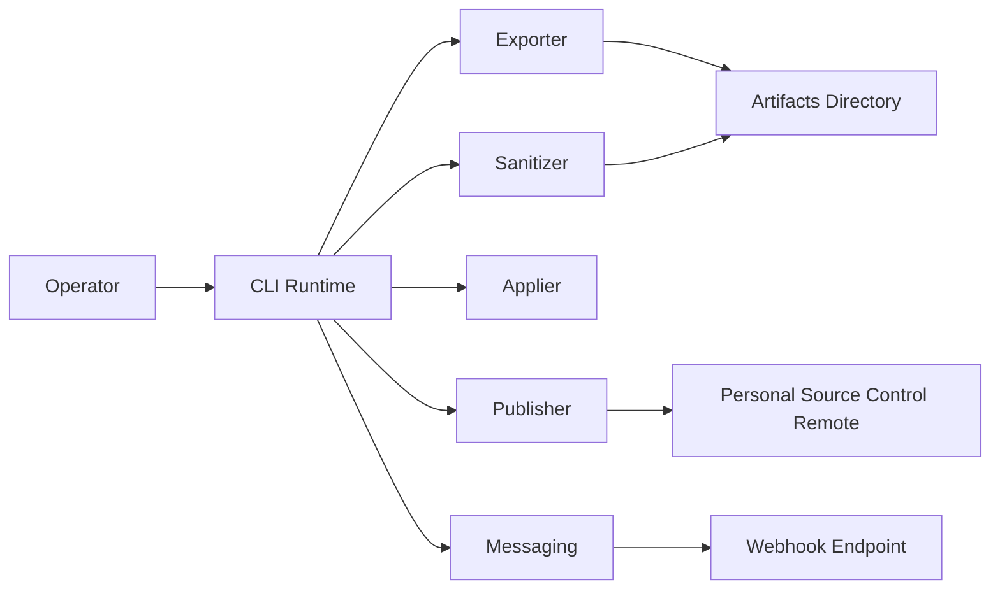
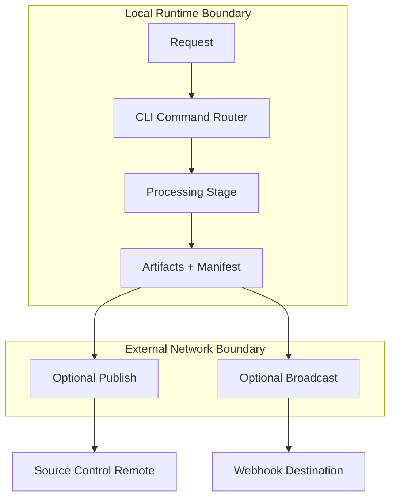
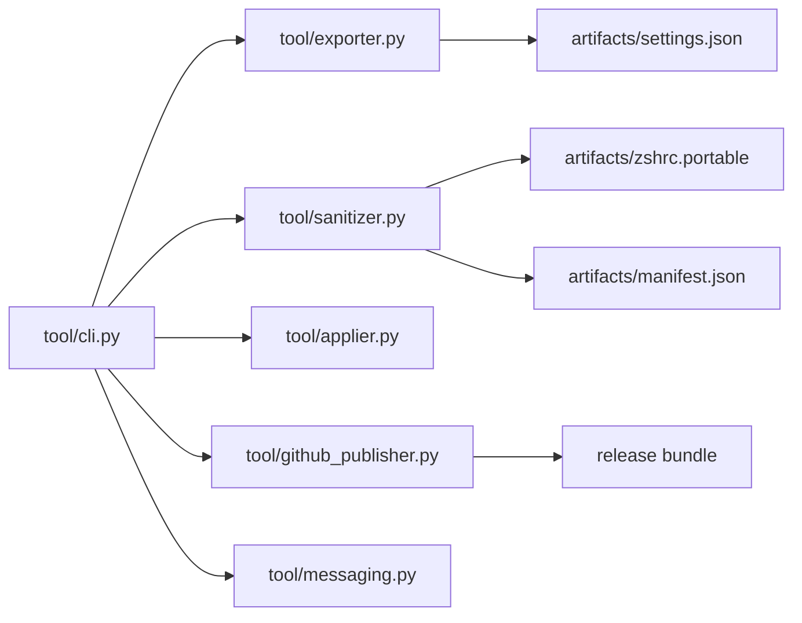

# Employer-Facing Conflict of Interest / CDI Disclosure Packet

**Owner:** [PERSONAL_OWNER]  
**Version:** v1.0-draft  
**Date:** 2026-03-04  
**Audience:** Compliance/HR, Legal, Security/IT, Technical Reviewer

---

## Artifact 1 — Employer-Facing Technical Dossier

### Purpose

This dossier explains what the platform does, how it operates, where trust boundaries exist, and what concrete controls prevent mixing with employer systems, intellectual property, credentials, infrastructure, or data.

### Reviewer Quick Start

Read first:
1. Scope and Boundaries
2. Separation from Employer Resources
3. Overlap Analysis and Risk Register

Evidence checkpoints:
- Repo ownership and access controls
- Billing and tenant ownership
- Separation controls checklist
- Commit/log provenance

### 1) Executive Overview

`Omniforge` is a personal software platform focused on exporting, sanitizing, applying, and packaging terminal profile configuration artifacts. It includes optional webhook broadcasting for operational documentation output.

Current state: personal project, local-first execution model, no required employer-system dependencies.

### 2) Scope and Boundaries

#### In scope
- Export terminal/profile configuration artifacts
- Sanitize shell profile content and generate portable output
- Package reproducible artifacts
- Optional webhook broadcast to personal communication channels

#### Out of scope
- Employer internal APIs
- Employer data ingestion or processing
- Employer SSO/Auth integration
- Employer cloud tenancy use
- Employer device-managed deployment

#### Explicit non-goals
- Building employer-adjacent feature parity
- Importing employer architecture/code/data
- Running this system on employer-owned infrastructure

### 3) High-Level Architecture

Trust boundaries:
1. Local runtime boundary (developer host)
2. External webhook boundary
3. Source-control boundary (personal repository)

### System Context Diagram

[EVIDENCE: Blueprint_Master_cockpit.md → glossary/components; Blueprint_Master_llm-flows.md → dependency map]

### Data Flow and Trust Boundaries

[EVIDENCE: Blueprint_bff.md → middleware stack + cqrs references; Blueprint_Master_haic-decision-system.md → request lifecycle]

### 4) Codebase Map

| Area | Summary |
|---|---|
| Repository | `Runndownn/Omniforge` |
| Primary language | Python |
| CLI entrypoint | `tool/cli.py` |
| Packaging config | `pyproject.toml` |
| Core modules | `tool/exporter.py`, `tool/sanitizer.py`, `tool/applier.py`, `tool/github_publisher.py`, `tool/messaging.py` |
| Tests | `tests/test_sanitizer.py`, `tests/test_messaging.py` |
| Generated outputs | `artifacts/*`, `tmp/*` |

### 5) Operational Walkthroughs

#### Workflow A — Sanitization
- Trigger: `sanitize` command
- Steps: read source profile → apply redaction rules → strip denylisted aliases → write portable output → update manifest/report
- Data touched: shell config text, generated manifest/log artifacts
- External calls: none
- Side effects: updated sanitized artifacts and checksums
- Security controls: token/email/path redaction patterns, denylist filtering

#### Workflow B — Broadcast to Messaging Webhook
- Trigger: `broadcast` command with service mode
- Steps: resolve webhook URL → apply service payload format (generic/slack/discord/teams) → chunk content → POST to endpoint
- Data touched: selected markdown/json artifacts
- External calls: webhook endpoint
- Side effects: outbound documentation message delivery
- Security controls: no embedded credentials in file content by policy; optional dry-run to validate output before send

#### Workflow C — Packaging/Release
- Trigger: `package` command
- Steps: stage artifacts → commit/tag (if changed) → create release archive + descriptor
- Data touched: repo files and release directory outputs
- External calls: optional git push
- Side effects: release package creation and optional remote update

### 6) Data Model and Storage

- Local file-based artifacts; no persistent multi-tenant database observed
- Manifest-driven integrity model (`sha256` checksums)
- Personal usage profile only; no stated employer or customer production data ingestion
- PII policy: sanitize before distribution
- Retention/backups: local backup snapshots for apply operations

### 7) Dependencies and Third-Party Services

| Category | Observed |
|---|---|
| Runtime libraries | `typer`, `rich`, `pyyaml` |
| Dev/test tools | `pytest`, `mypy`, `ruff` |
| External integrations | webhook endpoints (optional), git hosting |
| Licensing | MIT at project level; third-party/license verification recommended for vendored materials |

### 8) Deployment and Environments

- Primary mode: local execution
- CI/CD: not required for core local operation (may exist for packaging/release workflows)
- Secrets model: webhook URL via env var or CLI input
- Exposure model: outbound-only webhook calls; no always-on public service required

### 9) Security Posture

- Input sanitation in profile-processing path
- Error handling for network and HTTP failures in messaging path
- Scoped command execution model (explicit user-invoked CLI commands)
- No privileged daemon requirement for baseline workflows

Threat considerations (high-level):
- webhook misconfiguration
- accidental inclusion of unsanitized output
- dependency hygiene drift

### 10) Separation from Employer Resources

#### Separation Controls Checklist

| Control | Implemented? | Evidence | Notes |
|---|---|---|---|
| Separate source control account | [NEEDS INPUT] | Repo ownership/org membership screenshot/export | Must remain personal-only |
| Separate cloud tenant/billing | [NEEDS INPUT] | Billing account statement | No shared employer billing |
| Separate credentials store | [NEEDS INPUT] | Secret manager inventory | No employer vault use |
| Separate devices/user profiles | [NEEDS INPUT] | Device inventory and MDM status | Prefer personal unmanaged device |
| Separate network context | [NEEDS INPUT] | VPN/network policy evidence | No employer VPN for personal ops |
| Time boundary control | [NEEDS INPUT] | Calendar/work log attestation | Outside employer working hours |
| No employer data/code usage | [NEEDS INPUT] | Attestation + repo search evidence | Include periodic checks |

How to verify:
- inspect git remote owner and branch activity
- review billing owner metadata
- review secrets provenance and audit logs
- review explicit non-goal statements and changelog entries

### 11) Overlap Analysis and Risk Register

#### Similarities vs differences
- Possible similarity: developer tooling and automation patterns
- Material difference: personal terminal/profile portability focus, no employer integration path in provided material

#### Risk Register

| Risk | Likelihood | Impact | Mitigation | Residual Risk | Evidence |
|---|---:|---:|---|---|---|
| Functional overlap misinterpretation | Medium | High | Explicit boundary statement + approved non-goals | Medium | Dossier scope section |
| Resource mixing (accounts/devices) | Medium | High | Separation checklist + periodic attestation | Low-Med | Ownership/billing/device evidence |
| Unsanitized content in outbound messages | Medium | Medium | Dry-run validation + sanitization workflow + reviewer checks | Low-Med | Sanitization report + command logs |
| WebSocket abuse | Resource drain | `/ws` gated by feature flag + future scope enforcement, rate limiting hooks ready | [NEEDS INPUT] | [NEEDS INPUT] |
| Dependency/supply-chain drift | Medium | Medium | Routine updates, lint/test gates, optional SBOM | Low-Med | Dependency reports |

### 12) Roadmap and Guardrails

Guardrails for COI safety:
- Keep project scope in personal configuration and documentation tooling
- Require explicit self-review for potentially employer-adjacent feature proposals
- Maintain monthly separation attestation
- Escalate and pause if adjacency risk increases

### 13) Appendices

Appendix A — Evidence Packet
- Repo inventory and ownership proof
- Dependency export/license inventory
- Build/test logs
- Separation controls evidence

Appendix B — Diagram Inventory
- System context
- Data flow with trust boundaries
- Core sequence workflows
- Telemetry path

Appendix C — Glossary
- COI/CDI, SBOM, trust boundary, residual risk

---

## Artifact 2 — Observability and Telemetry Pack

### Purpose

This pack defines operational health criteria, telemetry expectations, and recurring evidence production for review.

### Reviewer Quick Start

Read first:
1. Observability goals
2. Instrumentation map
3. Monthly reporting template

Verify:
- log redaction behavior
- error/latency trend tracking
- monthly evidence archive consistency

### 1) Observability Goals

Healthy means:
- workflows complete without unhandled exceptions
- sanitize + package + broadcast paths succeed reliably
- failures are visible and attributable

Early-warning signals:
- increased webhook failures
- rising sanitize errors
- repeated packaging failures
- unusual outbound volume

### 2) Telemetry Architecture

Current state (from provided materials):
- command-level console logs and test outputs
- no confirmed full metrics/traces stack in provided input

Planned evidence model:
- structured event logs for command runs
- simple command metrics (success/fail, duration)
- monthly summary package from logs and changelog

### 3) Instrumentation Map

| Component | Logs | Metrics | Traces |
|---|---|---|---|
| Sanitizer | rule_applied, alias_removed, output_written | sanitize_runs_total, sanitize_failures_total, sanitize_duration_ms | `sanitize.run` |
| Messaging | webhook_attempt, webhook_success/failure, chunk_count | webhook_messages_total, webhook_errors_total, webhook_latency_ms | `broadcast.run`, `broadcast.send_chunk` |
| Publisher | package_start, package_complete, push_result | package_runs_total, package_failures_total | `package.run` |
| Applier | backup_created, apply_mode_result | apply_runs_total, apply_failures_total | `apply.run` |

Redaction rules:
- never log secrets, bearer values, or full credential-bearing URLs
- mask personally identifying paths where feasible

### 4) Dashboard Pack (What each panel proves)

1. **Reliability** — success/failure rate + p95 runtime
2. **Performance** — command durations and throughput
3. **Security signals** — auth failures, unusual outbound patterns, denylist triggers
4. **Operational drift** — dependency/version changes and test pass trend

### 5) Monthly Reporting Template

**Month:** [YYYY-MM]  
**Owner:** [PERSONAL_OWNER]

1. Changes shipped
2. Reliability summary (uptime-equivalent command success, incidents, MTTR)
3. Security events and mitigations
4. Usage + cost summary
5. Separation controls attestation update
6. Next actions and requested guidance

### 6) Recommended Diagram Set

- system context
- component map
- trust-boundary data flow
- sequence diagrams for sanitize/broadcast/package
- authz/RBAC map (if multi-user evolves)
- telemetry pipeline
- lightweight threat model

---

## Artifact 3 — CDI / COI Disclosure Summary (Decision Memo)

### Purpose

This memo is the concise approval request for compliance/legal determination, backed by the technical dossier and telemetry pack.

### Reviewer Quick Start

Read first:
1. Disclosure statement
2. Relationship and boundaries
3. Separation controls
4. Requested determination

### 1) Disclosure Statement

I disclose operation of a personal software platform for configuration portability and sanitization workflows. Based on provided inputs, it does not require employer systems or employer data to function.

### 2) Relationship to Employer Business

- Status relative to employer: **[NEEDS INPUT: unrelated / adjacent / potentially overlapping]**
- Boundary commitments:
  - no employer code/data
  - no employer infra/accounts
  - no employer-paid resources
  - no feature development intentionally targeting employer proprietary space

### 3) Separation Controls (Verifiable)

- personal repo ownership
- personal billing and cloud ownership
- personal credentials and secret storage
- personal device/network context
- time-boundary discipline

### 4) Top Risks and Mitigations

| Risk | Mitigation |
|---|---|
| Scope drift into employer-adjacent area | Explicit non-goals + escalation before implementation |
| Resource mixing | Separation checklist + evidence review cadence |
| Outbound message data leakage | Sanitization-first workflow + dry-run + review |
| Compliance ambiguity | Request written conditions and periodic review schedule |

### 5) Requested Determination

Please provide written confirmation of one outcome:
- Approved
- Approved with conditions
- Not approved

Requested conditions (if approval granted):
1. Maintain separation controls and evidence updates
2. Re-disclose before materially changing scope
3. Follow periodic review cadence as directed by Compliance/Legal

### 6) Attachments

- Artifact 1: Employer-Facing Technical Dossier
- Artifact 2: Observability & Telemetry Pack
- Supporting evidence set (ownership, billing, logs, dependencies, tests)

---

## Next Inputs Needed (Prioritized)

1. Employer business/domain overlap context to finalize risk language.
2. Verified separation evidence (account ownership, billing ownership, device/network separation).
3. Final owner identity metadata (name/title/contact).
4. Deployment/telemetry specifics if additional systems exist beyond current repo evidence.
5. Any revenue/commercial details needed by Legal.
