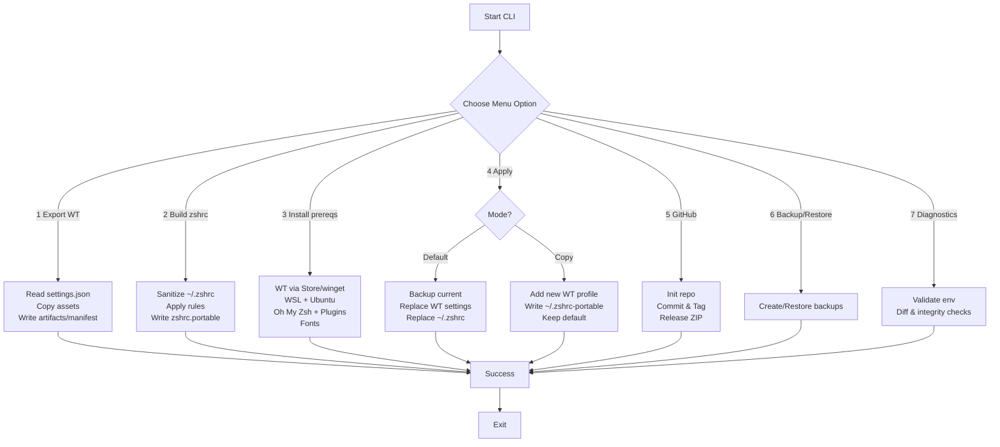
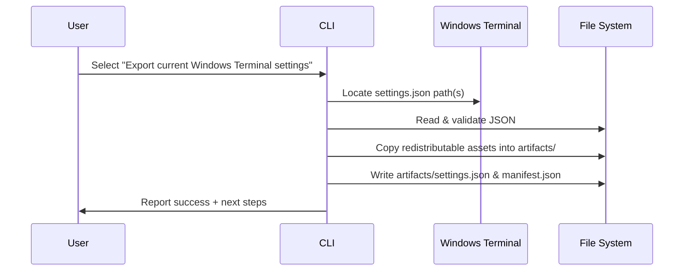
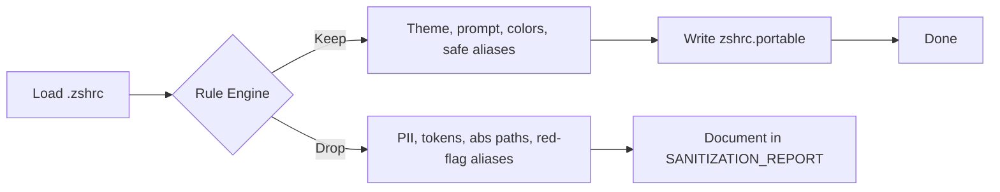
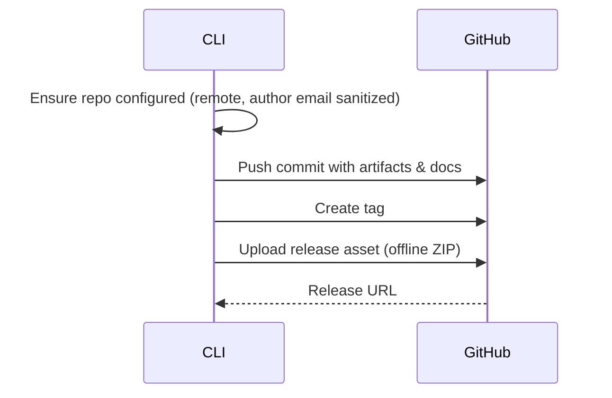

# Diagrams

## High-Level Flow

```mermaid
flowchart TD
    A[Start CLI] --> B{Choose Menu Option}
    B -->|1 Export WT| C[Read settings.json\nCopy assets\nWrite artifacts/manifest]
    B -->|2 Build zshrc| D[Sanitize ~/.zshrc\nApply rules\nWrite zshrc.portable]
    B -->|3 Install prereqs| E[WT via Store/winget\nWSL + Ubuntu\nOh My Zsh + Plugins\nFonts]
    B -->|4 Apply| F{Mode?}
    F -->|Default| G[Backup current\nReplace WT settings\nReplace ~/.zshrc]
    F -->|Copy| H[Add new WT profile\nWrite ~/.zshrc-portable\nKeep default]
    B -->|5 GitHub| I[Init repo\nCommit & Tag\nRelease ZIP]
    B -->|6 Backup/Restore| J[Create/Restore backups]
    B -->|7 Diagnostics| K[Validate env\nDiff & integrity checks]
    C --> L[Success]
    D --> L
    E --> L
    G --> L
    H --> L
    I --> L
    J --> L
    K --> L
    L --> M[Exit]
```

## Exporter Detail

```mermaid
sequenceDiagram
  participant User
  participant CLI
  participant WT as Windows Terminal
  participant FS as File System
  User->>CLI: Select "Export current Windows Terminal settings"
  CLI->>WT: Locate settings.json path(s)
  CLI->>FS: Read & validate JSON
  CLI->>FS: Copy redistributable assets into artifacts/
  CLI->>FS: Write artifacts/settings.json & manifest.json
  CLI->>User: Report success + next steps
```

## Sanitizer Pipeline

```mermaid
flowchart LR
  S[Load .zshrc] --> R{Rule Engine}
  R -->|Drop| PII[PII, tokens, abs paths, red-flag aliases]
  R -->|Keep| THEME[Theme, prompt, colors, safe aliases]
  THEME --> O[Write zshrc.portable]
  PII --> LOG[Document in SANITIZATION_REPORT]
  O --> DONE[Done]
```

## GitHub Publishing

```mermaid
sequenceDiagram
  participant CLI
  participant Git as GitHub
  CLI->>CLI: Ensure repo configured (remote, author email sanitized)
  CLI->>Git: Push commit with artifacts & docs
  CLI->>Git: Create tag
  CLI->>Git: Upload release asset (offline ZIP)
  Git-->>CLI: Release URL
```
