# Repository Inventory & Provenance Packet

## A) Title page

Repository name: Omniforge (derived from folder name and Git remote)

Inventory date/time: 2026-03-03T08:38:02+00:00

Commit hash / branch / dirty state: 1c1262a893ae4d16b4d08602ca47b944b7bc8df9 / master / Dirty (untracked: Omniforge.code-workspace)

Environment used: OS Linux (user-provided), shell bash (context). Tool versions: Unknown from available evidence.

Snapshot objective statement: “A clean, reproducible backup snapshot suitable for restoring the repo and resuming development, without committing machine-specific state.”

## B) Executive summary

Omniforge appears to be a Python CLI toolkit that exports, sanitizes, and reapplies Windows Terminal and WSL shell profile assets. Evidence indicates a Typer-powered command-line interface orchestrating export, sanitization, prerequisite installation, application, diagnostics, and release packaging, with artifacts stored under artifacts/ and supporting docs under docs/.

Key risks and immediate implications for a new employer include: the presence of vendored dependencies and generated artifacts that require careful IP separation and license attribution; operational steps that reference Windows/WSL tooling; and a dirty working tree with an untracked workspace file that should not be included in a clean-room snapshot. These indicate a need for strict exclusion rules, clear provenance labeling, and a validated backup branch process before transition.

## C) Repository overview

High-level purpose and runtime model: This repository provides a CLI-driven workflow for exporting and sanitizing Windows Terminal settings and WSL shell profiles, then applying or packaging them for reuse. It runs as a command-line application intended for operators managing Windows Terminal and WSL setups, with optional automation via scripts and CI references.

Primary languages, frameworks, platforms, and build/test posture: Python is the primary language, with shell and PowerShell scripts for platform setup. Frameworks include Typer for CLI and Rich for console UI. The project targets Windows and WSL primarily, with notes for macOS/Linux consumers. Testing and linting are referenced via pytest, ruff, mypy, and bandit, and Makefile targets are present.

Top-level directory map and first-look pointers:
- README.md: primary overview, CLI surface, and architecture guidance.
- tool/: Python implementation of the CLI and pipelines (tool/cli.py is the entry point).
- docs/: extended documentation and diagrams.
- artifacts/: generated payloads and manifests (not authoritative source).
- scripts/: setup helpers for Windows and WSL.
- tests/: pytest coverage and sanitizer tests.
- vendor/: vendored third-party resources and licenses.
- tmp/: scratch outputs and test artifacts.
- windows_terminal_portable_profile.egg-info/: packaging metadata.

Initial top-level architecture diagram:

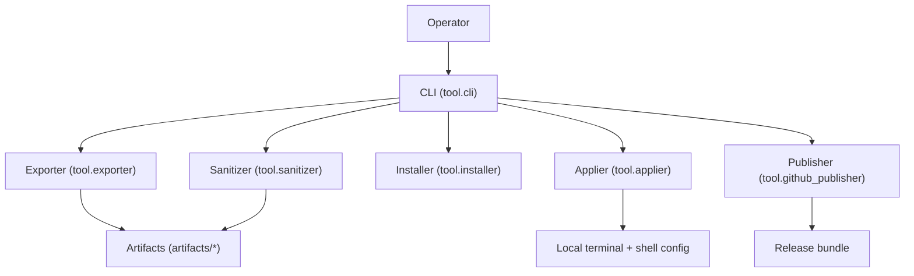

This diagram summarizes the observed module interactions: the CLI orchestrates discrete pipeline steps that read from live system sources, write sanitized artifacts, optionally apply them locally, and package a release. The nodes align with the tool/ modules and artifacts/ directory described in repository documentation.

## D) Full file and folder inventory (comprehensive; recursive)

- Path: [.git](.git) | Type: dir | Size: 4096 bytes | Mtime: 2026-03-03T08:32:47.180173+00:00 | Role/purpose: Git metadata directory (contents not inspected) | Language/entrypoint: N/A | Dependencies: Git tooling | Classification: Generated (VCS metadata) | Flags: none
- Path: [.github](.github) | Type: dir | Size: 4096 bytes | Mtime: 2025-12-04T23:01:21.296126+00:00 | Role/purpose: GitHub configuration and documentation | Language/entrypoint: N/A | Dependencies: GitHub Actions | Classification: Authored here | Flags: none
- Path: [.github/README.md](.github/README.md) | Type: file (.md) | Size: 14133 bytes | Mtime: 2025-12-04T23:01:21.296126+00:00 | Role/purpose: GitHub-facing repository overview; mirrors main README | Language/entrypoint: Markdown | Dependencies: References tool modules and docs | Classification: Authored here | Flags: none
- Path: [.github/workflows](.github/workflows) | Type: dir | Size: 4096 bytes | Mtime: 2025-12-04T23:01:21.296126+00:00 | Role/purpose: CI/CD workflows | Language/entrypoint: N/A | Dependencies: GitHub Actions | Classification: Authored here | Flags: none
- Path: [.github/workflows/release.yml](.github/workflows/release.yml) | Type: file (.yml) | Size: 1257 bytes | Mtime: 2025-12-04T23:01:21.296126+00:00 | Role/purpose: GitHub Actions release workflow for lint/test/build/package/release | Language/entrypoint: YAML workflow | Dependencies: actions/checkout, actions/setup-python, ruff, pytest, mypy, tool.cli package | Classification: Authored here | Flags: none
- Path: [.gitignore](.gitignore) | Type: file (no extension) | Size: 180 bytes | Mtime: 2025-12-04T23:01:21.296126+00:00 | Role/purpose: Git ignore rules for local artifacts and caches | Language/entrypoint: Git config | Dependencies: Git | Classification: Authored here | Flags: none
- Path: [LICENSE](LICENSE) | Type: file (no extension) | Size: 1068 bytes | Mtime: 2025-12-04T23:01:21.296126+00:00 | Role/purpose: Project license text | Language/entrypoint: Plain text | Dependencies: N/A | Classification: Authored here (license declaration) | Flags: none
- Path: [Makefile](Makefile) | Type: file (no extension) | Size: 1454 bytes | Mtime: 2025-12-04T23:01:21.296126+00:00 | Role/purpose: PowerShell-oriented build/test helper targets | Language/entrypoint: Makefile/PowerShell commands | Dependencies: python, ruff, pytest, mypy | Classification: Authored here | Flags: none
- Path: [Omniforge.code-workspace](Omniforge.code-workspace) | Type: file (.code-workspace) | Size: 43 bytes | Mtime: 2026-03-03T08:26:54.103671+00:00 | Role/purpose: VS Code workspace settings (local) | Language/entrypoint: JSON (workspace) | Dependencies: VS Code | Classification: Generated (local environment) | Flags: local/workstation-specific
- Path: [README.md](README.md) | Type: file (.md) | Size: 14133 bytes | Mtime: 2025-12-04T23:01:21.296126+00:00 | Role/purpose: Primary repository overview and usage guidance | Language/entrypoint: Markdown | Dependencies: References tool modules and docs | Classification: Authored here | Flags: none
- Path: [README_remote_preview.txt](README_remote_preview.txt) | Type: file (.txt) | Size: 14151 bytes | Mtime: 2025-12-04T23:01:21.296126+00:00 | Role/purpose: Text mirror of README for remote preview tooling | Language/entrypoint: Plain text | Dependencies: Mirrors README content | Classification: Authored here | Flags: none
- Path: [artifacts](artifacts) | Type: dir | Size: 4096 bytes | Mtime: 2025-12-04T23:01:21.296126+00:00 | Role/purpose: Generated portable artifacts and manifests | Language/entrypoint: N/A | Dependencies: tool.exporter, tool.sanitizer | Classification: Generated | Flags: contains generated payloads
- Path: [artifacts/README.md](artifacts/README.md) | Type: file (.md) | Size: 2671 bytes | Mtime: 2025-12-04T23:01:21.296126+00:00 | Role/purpose: Describes artifact contents and integrity guarantees | Language/entrypoint: Markdown | Dependencies: tool.exporter, tool.sanitizer, tool.applier | Classification: Authored here | Flags: none
- Path: [artifacts/assets](artifacts/assets) | Type: dir | Size: 4096 bytes | Mtime: 2025-12-04T23:01:21.296126+00:00 | Role/purpose: Generated assets referenced by settings.json | Language/entrypoint: N/A | Dependencies: tool.exporter | Classification: Generated | Flags: placeholder directory
- Path: [artifacts/assets/.gitkeep](artifacts/assets/.gitkeep) | Type: file (no extension) | Size: 0 bytes | Mtime: 2025-12-04T23:01:21.296126+00:00 | Role/purpose: Keeps empty assets directory tracked | Language/entrypoint: N/A | Dependencies: Git | Classification: Authored here | Flags: none
- Path: [artifacts/assets/README.md](artifacts/assets/README.md) | Type: file (.md) | Size: 1709 bytes | Mtime: 2025-12-04T23:01:21.296126+00:00 | Role/purpose: Explains asset handling | Language/entrypoint: Markdown | Dependencies: tool.exporter | Classification: Authored here | Flags: none
- Path: [artifacts/fonts](artifacts/fonts) | Type: dir | Size: 4096 bytes | Mtime: 2025-12-04T23:01:21.296126+00:00 | Role/purpose: Generated font payloads | Language/entrypoint: N/A | Dependencies: tool.installer | Classification: Generated | Flags: placeholder directory
- Path: [artifacts/fonts/.gitkeep](artifacts/fonts/.gitkeep) | Type: file (no extension) | Size: 0 bytes | Mtime: 2025-12-04T23:01:21.296126+00:00 | Role/purpose: Keeps empty fonts directory tracked | Language/entrypoint: N/A | Dependencies: Git | Classification: Authored here | Flags: none
- Path: [artifacts/fonts/README.md](artifacts/fonts/README.md) | Type: file (.md) | Size: 1449 bytes | Mtime: 2025-12-04T23:01:21.296126+00:00 | Role/purpose: Describes font bundling expectations | Language/entrypoint: Markdown | Dependencies: tool.installer | Classification: Authored here | Flags: none
- Path: [artifacts/manifest.json](artifacts/manifest.json) | Type: file (.json) | Size: 1008 bytes | Mtime: 2025-12-04T23:01:21.296126+00:00 | Role/purpose: SHA-256 manifest of generated artifacts | Language/entrypoint: JSON | Dependencies: tool.exporter, tool.sanitizer | Classification: Generated | Flags: contains hashes
- Path: [artifacts/settings.json](artifacts/settings.json) | Type: file (.json) | Size: 1768 bytes | Mtime: 2025-12-04T23:01:21.296126+00:00 | Role/purpose: Sanitized Windows Terminal settings | Language/entrypoint: JSON | Dependencies: tool.exporter | Classification: Generated | Flags: contains runtime config
- Path: [artifacts/zshrc.portable](artifacts/zshrc.portable) | Type: file (.portable) | Size: 6094 bytes | Mtime: 2025-12-04T23:01:21.296126+00:00 | Role/purpose: Sanitized portable shell profile | Language/entrypoint: Shell config (zsh) | Dependencies: tool.sanitizer | Classification: Generated | Flags: contains runtime config
- Path: [docs](docs) | Type: dir | Size: 4096 bytes | Mtime: 2026-03-03T08:38:37.868682+00:00 | Role/purpose: Documentation set | Language/entrypoint: N/A | Dependencies: tool/* modules | Classification: Authored here | Flags: none
- Path: [docs/DIAGRAMS.md](docs/DIAGRAMS.md) | Type: file (.md) | Size: 1919 bytes | Mtime: 2025-12-04T23:01:21.296126+00:00 | Role/purpose: Architecture diagrams | Language/entrypoint: Markdown | Dependencies: tool/README.md | Classification: Authored here | Flags: none
- Path: [docs/Inventory](docs/Inventory) | Type: dir | Size: 4096 bytes | Mtime: 2026-03-03T08:38:37.920681+00:00 | Role/purpose: Repository inventory artifacts | Language/entrypoint: N/A | Dependencies: Inventory process | Classification: Generated (audit output) | Flags: evidence artifact
- Path: [docs/Inventory/Omniforge-Inventory.md](docs/Inventory/Omniforge-Inventory.md) | Type: file (.md) | Size: 3761 bytes | Mtime: 2026-03-03T08:39:02.780433+00:00 | Role/purpose: Inventory and provenance packet in progress | Language/entrypoint: Markdown | Dependencies: Repository audit process | Classification: Generated (audit output) | Flags: evidence artifact
- Path: [docs/README.md](docs/README.md) | Type: file (.md) | Size: 1734 bytes | Mtime: 2025-12-04T23:01:21.296126+00:00 | Role/purpose: Documentation index and update guidance | Language/entrypoint: Markdown | Dependencies: tool/sanitizer.py, tool/cli.py | Classification: Authored here | Flags: none
- Path: [docs/SANITIZATION_REPORT.md](docs/SANITIZATION_REPORT.md) | Type: file (.md) | Size: 1529 bytes | Mtime: 2025-12-04T23:01:21.296126+00:00 | Role/purpose: Append-only sanitization ledger | Language/entrypoint: Markdown | Dependencies: tool/sanitizer.py | Classification: Authored here | Flags: audit log
- Path: [docs/USAGE.md](docs/USAGE.md) | Type: file (.md) | Size: 3251 bytes | Mtime: 2025-12-04T23:01:21.296126+00:00 | Role/purpose: Operator usage guide | Language/entrypoint: Markdown | Dependencies: tool/cli.py | Classification: Authored here | Flags: none
- Path: [geezer_data.instructions.md](geezer_data.instructions.md) | Type: file (.md) | Size: 151 bytes | Mtime: 2026-03-03T08:39:02.780433+00:00 | Role/purpose: Local instruction placeholder created for this audit session | Language/entrypoint: Markdown | Dependencies: Audit process | Classification: Generated (audit support) | Flags: local-only
- Path: [image](image) | Type: dir | Size: 4096 bytes | Mtime: 2025-12-04T23:01:21.296126+00:00 | Role/purpose: Documentation image assets | Language/entrypoint: N/A | Dependencies: README assets | Classification: Unknown provenance | Flags: binary assets
- Path: [image/README](image/README) | Type: dir | Size: 4096 bytes | Mtime: 2025-12-04T23:01:21.296126+00:00 | Role/purpose: README image bundle | Language/entrypoint: N/A | Dependencies: README | Classification: Unknown provenance | Flags: binary assets
- Path: [image/README/1761736392562.png](image/README/1761736392562.png) | Type: file (.png) | Size: 44881 bytes | Mtime: 2025-12-04T23:01:21.296126+00:00 | Role/purpose: Documentation image asset (exact usage not confirmed) | Language/entrypoint: PNG image | Dependencies: README or docs | Classification: Unknown provenance | Flags: binary blob
- Path: [image/README/1761736402115.png](image/README/1761736402115.png) | Type: file (.png) | Size: 44881 bytes | Mtime: 2025-12-04T23:01:21.296126+00:00 | Role/purpose: Documentation image asset (exact usage not confirmed) | Language/entrypoint: PNG image | Dependencies: README or docs | Classification: Unknown provenance | Flags: binary blob
- Path: [pyproject.toml](pyproject.toml) | Type: file (.toml) | Size: 1214 bytes | Mtime: 2025-12-04T23:01:21.296126+00:00 | Role/purpose: Python project metadata and tool configuration | Language/entrypoint: TOML | Dependencies: setuptools, pytest, ruff, mypy | Classification: Authored here | Flags: none
- Path: [requirements.txt](requirements.txt) | Type: file (.txt) | Size: 39 bytes | Mtime: 2025-12-04T23:01:21.296126+00:00 | Role/purpose: Runtime dependencies list | Language/entrypoint: Plain text | Dependencies: pyyaml, rich, typer | Classification: Authored here | Flags: none
- Path: [scripts](scripts) | Type: dir | Size: 4096 bytes | Mtime: 2025-12-04T23:01:21.296126+00:00 | Role/purpose: Automation scripts for setup and apply flows | Language/entrypoint: N/A | Dependencies: tool/cli.py | Classification: Authored here | Flags: none
- Path: [scripts/README.md](scripts/README.md) | Type: file (.md) | Size: 1454 bytes | Mtime: 2025-12-04T23:01:21.296126+00:00 | Role/purpose: Script catalog and usage notes | Language/entrypoint: Markdown | Dependencies: scripts/*.sh, scripts/*.ps1 | Classification: Authored here | Flags: none
- Path: [scripts/apply_local.sh](scripts/apply_local.sh) | Type: file (.sh) | Size: 791 bytes | Mtime: 2025-12-04T23:01:21.296126+00:00 | Role/purpose: Apply workflow wrapper for CI and local validation | Language/entrypoint: Shell script | Dependencies: python -m tool.cli apply | Classification: Authored here | Flags: executable script
- Path: [scripts/install_prereqs.ps1](scripts/install_prereqs.ps1) | Type: file (.ps1) | Size: 1691 bytes | Mtime: 2025-12-04T23:01:21.296126+00:00 | Role/purpose: PowerShell wrapper for installing prerequisites | Language/entrypoint: PowerShell script | Dependencies: python -m tool.cli install | Classification: Authored here | Flags: executable script
- Path: [scripts/install_wsl.sh](scripts/install_wsl.sh) | Type: file (.sh) | Size: 380 bytes | Mtime: 2025-12-04T23:01:21.296126+00:00 | Role/purpose: WSL install helper and bootstrapper | Language/entrypoint: Shell script | Dependencies: tool.cli install | Classification: Authored here | Flags: executable script
- Path: [tests](tests) | Type: dir | Size: 4096 bytes | Mtime: 2025-12-04T23:01:21.296126+00:00 | Role/purpose: Test suite | Language/entrypoint: N/A | Dependencies: pytest | Classification: Authored here | Flags: none
- Path: [tests/README.md](tests/README.md) | Type: file (.md) | Size: 1296 bytes | Mtime: 2025-12-04T23:01:21.296126+00:00 | Role/purpose: Test suite description and guidance | Language/entrypoint: Markdown | Dependencies: pytest, tool/sanitizer.py | Classification: Authored here | Flags: none
- Path: [tests/test_sanitizer.py](tests/test_sanitizer.py) | Type: file (.py) | Size: 583 bytes | Mtime: 2025-12-04T23:01:21.296126+00:00 | Role/purpose: Unit tests for sanitizer rules and helpers | Language/entrypoint: Python (pytest) | Dependencies: tool.sanitizer | Classification: Authored here | Flags: none
- Path: [tmp](tmp) | Type: dir | Size: 4096 bytes | Mtime: 2025-12-04T23:01:21.296126+00:00 | Role/purpose: Ephemeral runtime and test outputs | Language/entrypoint: N/A | Dependencies: pytest, tool tooling | Classification: Cache/Generated | Flags: transient
- Path: [tmp/README.md](tmp/README.md) | Type: file (.md) | Size: 1000 bytes | Mtime: 2025-12-04T23:01:21.296126+00:00 | Role/purpose: Explains temp layout and cleanup guidance | Language/entrypoint: Markdown | Dependencies: pytest, pyproject.toml | Classification: Authored here | Flags: none
- Path: [tmp/inventory_phase2.tsv](tmp/inventory_phase2.tsv) | Type: file (.tsv) | Size: 5618 bytes | Mtime: 2026-03-03T08:40:21.003652+00:00 | Role/purpose: Phase 2 inventory evidence output | Language/entrypoint: TSV | Dependencies: Audit process | Classification: Generated (audit output) | Flags: evidence artifact
- Path: [tmp/checksums_sha256.txt](tmp/checksums_sha256.txt) | Type: file (.txt) | Size: 5719 bytes | Mtime: 2026-03-03T08:49:31.090158+00:00 | Role/purpose: SHA-256 checksum manifest for repository files | Language/entrypoint: Plain text | Dependencies: Audit process | Classification: Generated (audit output) | Flags: evidence artifact
- Path: [tmp/pytest](tmp/pytest) | Type: dir | Size: 4096 bytes | Mtime: 2025-12-04T23:01:21.300126+00:00 | Role/purpose: pytest base temp directory | Language/entrypoint: N/A | Dependencies: pytest | Classification: Cache/Generated | Flags: transient
- Path: [tmp/pytest/README.md](tmp/pytest/README.md) | Type: file (.md) | Size: 828 bytes | Mtime: 2025-12-04T23:01:21.300126+00:00 | Role/purpose: Explains pytest temp usage | Language/entrypoint: Markdown | Dependencies: pytest | Classification: Authored here | Flags: none
- Path: [tmp/pytest/test_strip_denylisted_aliases0](tmp/pytest/test_strip_denylisted_aliases0) | Type: dir | Size: 4096 bytes | Mtime: 2025-12-04T23:01:21.300126+00:00 | Role/purpose: pytest run fixture output | Language/entrypoint: N/A | Dependencies: pytest | Classification: Cache/Generated | Flags: transient
- Path: [tmp/pytest/test_strip_denylisted_aliases0/.zshrc](tmp/pytest/test_strip_denylisted_aliases0/.zshrc) | Type: file (no extension) | Size: 48 bytes | Mtime: 2025-12-04T23:01:21.300126+00:00 | Role/purpose: Test fixture output for sanitizer | Language/entrypoint: Shell config (zsh) | Dependencies: pytest, tool.sanitizer | Classification: Cache/Generated | Flags: transient
- Path: [tmp/pytest/test_strip_denylisted_aliases0/README.md](tmp/pytest/test_strip_denylisted_aliases0/README.md) | Type: file (.md) | Size: 704 bytes | Mtime: 2025-12-04T23:01:21.300126+00:00 | Role/purpose: Describes test fixture output | Language/entrypoint: Markdown | Dependencies: pytest | Classification: Authored here | Flags: none
- Path: [tmp/pytest/test_strip_denylisted_aliases0/manifest.json](tmp/pytest/test_strip_denylisted_aliases0/manifest.json) | Type: file (.json) | Size: 297 bytes | Mtime: 2025-12-04T23:01:21.300126+00:00 | Role/purpose: Test manifest output for sanitizer | Language/entrypoint: JSON | Dependencies: tool.sanitizer | Classification: Cache/Generated | Flags: transient
- Path: [tmp/pytest/test_strip_denylisted_aliases0/portable](tmp/pytest/test_strip_denylisted_aliases0/portable) | Type: file (no extension) | Size: 19 bytes | Mtime: 2025-12-04T23:01:21.300126+00:00 | Role/purpose: Test portable profile output | Language/entrypoint: Plain text | Dependencies: tool.sanitizer | Classification: Cache/Generated | Flags: transient
- Path: [tmp/pytest/test_strip_denylisted_aliases0/report.md](tmp/pytest/test_strip_denylisted_aliases0/report.md) | Type: file (.md) | Size: 193 bytes | Mtime: 2025-12-04T23:01:21.300126+00:00 | Role/purpose: Sanitizer test report output | Language/entrypoint: Markdown | Dependencies: tool.sanitizer | Classification: Cache/Generated | Flags: transient
- Path: [tool](tool) | Type: dir | Size: 4096 bytes | Mtime: 2025-12-04T23:01:21.300126+00:00 | Role/purpose: Python package implementing the CLI and pipelines | Language/entrypoint: Python package | Dependencies: typer, rich, pyyaml | Classification: Authored here | Flags: none
- Path: [tool/README.md](tool/README.md) | Type: file (.md) | Size: 3785 bytes | Mtime: 2025-12-04T23:01:21.300126+00:00 | Role/purpose: Module inventory and architecture notes | Language/entrypoint: Markdown | Dependencies: tool/* modules | Classification: Authored here | Flags: none
- Path: [tool/__init__.py](tool/__init__.py) | Type: file (.py) | Size: 210 bytes | Mtime: 2025-12-04T23:01:21.300126+00:00 | Role/purpose: Package initializer | Language/entrypoint: Python | Dependencies: N/A | Classification: Authored here | Flags: none
- Path: [tool/applier.py](tool/applier.py) | Type: file (.py) | Size: 6796 bytes | Mtime: 2025-12-04T23:01:21.300126+00:00 | Role/purpose: Applies sanitized settings and backups | Language/entrypoint: Python | Dependencies: tool.validators, artifacts/* | Classification: Authored here | Flags: none
- Path: [tool/cli.py](tool/cli.py) | Type: file (.py) | Size: 7384 bytes | Mtime: 2025-12-04T23:01:21.300126+00:00 | Role/purpose: CLI entry point (Typer app) | Language/entrypoint: Python CLI | Dependencies: typer, rich, tool.* modules | Classification: Authored here | Flags: primary entrypoint
- Path: [tool/exporter.py](tool/exporter.py) | Type: file (.py) | Size: 4732 bytes | Mtime: 2025-12-04T23:01:21.300126+00:00 | Role/purpose: Exports and sanitizes Windows Terminal settings | Language/entrypoint: Python | Dependencies: tool.validators, artifacts/* | Classification: Authored here | Flags: none
- Path: [tool/github_publisher.py](tool/github_publisher.py) | Type: file (.py) | Size: 3148 bytes | Mtime: 2025-12-04T23:01:21.300126+00:00 | Role/purpose: Release packaging and publishing | Language/entrypoint: Python | Dependencies: git, artifacts/* | Classification: Authored here | Flags: none
- Path: [tool/installer.py](tool/installer.py) | Type: file (.py) | Size: 3794 bytes | Mtime: 2025-12-04T23:01:21.300126+00:00 | Role/purpose: Installs prerequisites (WSL, fonts, Oh My Zsh) | Language/entrypoint: Python | Dependencies: vendor/*, system package managers | Classification: Authored here | Flags: none
- Path: [tool/sanitizer.py](tool/sanitizer.py) | Type: file (.py) | Size: 4595 bytes | Mtime: 2025-12-04T23:01:21.300126+00:00 | Role/purpose: Sanitizes .zshrc and updates manifest/report | Language/entrypoint: Python | Dependencies: artifacts/*, docs/SANITIZATION_REPORT.md | Classification: Authored here | Flags: none
- Path: [tool/validators.py](tool/validators.py) | Type: file (.py) | Size: 4799 bytes | Mtime: 2025-12-04T23:01:21.300126+00:00 | Role/purpose: Validates environment and manifest correctness | Language/entrypoint: Python | Dependencies: artifacts/* | Classification: Authored here | Flags: none
- Path: [vendor](vendor) | Type: dir | Size: 4096 bytes | Mtime: 2025-12-04T23:01:21.300126+00:00 | Role/purpose: Vendored third-party resources | Language/entrypoint: N/A | Dependencies: tool.installer | Classification: Vendored | Flags: third-party content
- Path: [vendor/README.md](vendor/README.md) | Type: file (.md) | Size: 1009 bytes | Mtime: 2025-12-04T23:01:21.300126+00:00 | Role/purpose: Vendor policy and update guidance | Language/entrypoint: Markdown | Dependencies: vendor/* | Classification: Authored here | Flags: none
- Path: [vendor/oh-my-zsh](vendor/oh-my-zsh) | Type: dir | Size: 4096 bytes | Mtime: 2025-12-04T23:01:21.300126+00:00 | Role/purpose: Vendored Oh My Zsh content (placeholder) | Language/entrypoint: N/A | Dependencies: tool.installer | Classification: Vendored | Flags: third-party content
- Path: [vendor/oh-my-zsh/.gitkeep](vendor/oh-my-zsh/.gitkeep) | Type: file (no extension) | Size: 0 bytes | Mtime: 2025-12-04T23:01:21.300126+00:00 | Role/purpose: Keeps directory tracked | Language/entrypoint: N/A | Dependencies: Git | Classification: Authored here | Flags: none
- Path: [vendor/oh-my-zsh/README.md](vendor/oh-my-zsh/README.md) | Type: file (.md) | Size: 803 bytes | Mtime: 2025-12-04T23:01:21.300126+00:00 | Role/purpose: Oh My Zsh vendoring notes | Language/entrypoint: Markdown | Dependencies: tool.installer | Classification: Authored here | Flags: none
- Path: [vendor/plugins](vendor/plugins) | Type: dir | Size: 4096 bytes | Mtime: 2025-12-04T23:01:21.300126+00:00 | Role/purpose: Vendored plugin placeholders | Language/entrypoint: N/A | Dependencies: tool.installer | Classification: Vendored | Flags: third-party content
- Path: [vendor/plugins/.gitkeep](vendor/plugins/.gitkeep) | Type: file (no extension) | Size: 0 bytes | Mtime: 2025-12-04T23:01:21.300126+00:00 | Role/purpose: Keeps directory tracked | Language/entrypoint: N/A | Dependencies: Git | Classification: Authored here | Flags: none
- Path: [vendor/plugins/README.md](vendor/plugins/README.md) | Type: file (.md) | Size: 748 bytes | Mtime: 2025-12-04T23:01:21.300126+00:00 | Role/purpose: Plugin vendoring notes | Language/entrypoint: Markdown | Dependencies: tool.installer | Classification: Authored here | Flags: none
- Path: [windows_terminal_portable_profile.egg-info](windows_terminal_portable_profile.egg-info) | Type: dir | Size: 4096 bytes | Mtime: 2025-12-04T23:01:21.300126+00:00 | Role/purpose: Setuptools metadata for editable install | Language/entrypoint: N/A | Dependencies: setuptools, pip | Classification: Generated (build output) | Flags: build metadata
- Path: [windows_terminal_portable_profile.egg-info/PKG-INFO](windows_terminal_portable_profile.egg-info/PKG-INFO) | Type: file (no extension) | Size: 4432 bytes | Mtime: 2025-12-04T23:01:21.300126+00:00 | Role/purpose: Packaged project metadata snapshot | Language/entrypoint: Plain text | Dependencies: setuptools | Classification: Generated (build output) | Flags: build metadata
- Path: [windows_terminal_portable_profile.egg-info/README.md](windows_terminal_portable_profile.egg-info/README.md) | Type: file (.md) | Size: 1004 bytes | Mtime: 2025-12-04T23:01:21.300126+00:00 | Role/purpose: Packaging metadata readme | Language/entrypoint: Markdown | Dependencies: setuptools | Classification: Generated (build output) | Flags: build metadata
- Path: [windows_terminal_portable_profile.egg-info/SOURCES.txt](windows_terminal_portable_profile.egg-info/SOURCES.txt) | Type: file (.txt) | Size: 542 bytes | Mtime: 2025-12-04T23:01:21.300126+00:00 | Role/purpose: Packaging source manifest | Language/entrypoint: Plain text | Dependencies: setuptools | Classification: Generated (build output) | Flags: build metadata
- Path: [windows_terminal_portable_profile.egg-info/dependency_links.txt](windows_terminal_portable_profile.egg-info/dependency_links.txt) | Type: file (.txt) | Size: 1 bytes | Mtime: 2025-12-04T23:01:21.300126+00:00 | Role/purpose: Packaging dependency links | Language/entrypoint: Plain text | Dependencies: setuptools | Classification: Generated (build output) | Flags: build metadata
- Path: [windows_terminal_portable_profile.egg-info/entry_points.txt](windows_terminal_portable_profile.egg-info/entry_points.txt) | Type: file (.txt) | Size: 46 bytes | Mtime: 2025-12-04T23:01:21.300126+00:00 | Role/purpose: Console scripts registration | Language/entrypoint: Plain text | Dependencies: setuptools | Classification: Generated (build output) | Flags: build metadata
- Path: [windows_terminal_portable_profile.egg-info/requires.txt](windows_terminal_portable_profile.egg-info/requires.txt) | Type: file (.txt) | Size: 110 bytes | Mtime: 2025-12-04T23:01:21.300126+00:00 | Role/purpose: Build-time requirements snapshot | Language/entrypoint: Plain text | Dependencies: setuptools | Classification: Generated (build output) | Flags: build metadata
- Path: [windows_terminal_portable_profile.egg-info/top_level.txt](windows_terminal_portable_profile.egg-info/top_level.txt) | Type: file (.txt) | Size: 5 bytes | Mtime: 2025-12-04T23:01:21.300126+00:00 | Role/purpose: Top-level package list | Language/entrypoint: Plain text | Dependencies: setuptools | Classification: Generated (build output) | Flags: build metadata

## E) Documentation, plans, prompts, and “tribal knowledge” extraction

- Path: [README.md](README.md) | Practical meaning: Primary operator overview with install, CLI usage, and architecture visuals. Operators should follow the export → sanitize → apply → package flow and use `python -m tool.cli --menu` to access guided workflows. Assumptions: Python 3.11+ and Git available; Windows/WSL tooling for full functionality. Missing steps: explicit offline packaging validation steps beyond CLI references.
- Path: [README_remote_preview.txt](README_remote_preview.txt) | Practical meaning: Text mirror of the README intended for remote preview tooling; content duplicates the primary overview. Assumptions: Same as README. Missing steps: none unique to this file.
- Path: [.github/README.md](.github/README.md) | Practical meaning: GitHub-facing overview duplicating the main README; intended for repository page rendering. Assumptions: Same as README. Missing steps: none unique to this file.
- Path: [docs/README.md](docs/README.md) | Practical meaning: Documentation index and maintenance guidance; directs operators to usage, sanitization ledger, and diagrams. Assumptions: Documentation is maintained alongside code; sanitizer appends to the report. Missing steps: explicit doc update checklist tied to release workflow.
- Path: [docs/USAGE.md](docs/USAGE.md) | Practical meaning: Step-by-step operator runbook for installation, workflow, backup/restore, and offline use; defines menu option mappings and troubleshooting remedies. Assumptions: Windows + WSL availability; users can run PowerShell and Python CLI. Missing steps: explicit validation of downloaded offline ZIP integrity.
- Path: [docs/SANITIZATION_REPORT.md](docs/SANITIZATION_REPORT.md) | Practical meaning: Describes sanitization rules, preserved content, and manual review flags for images/plugins. Assumptions: Sanitizer enforces regex-based redactions; manual review required for newly added assets/plugins. Missing steps: explicit approval workflow for manual review flags.
- Path: [docs/DIAGRAMS.md](docs/DIAGRAMS.md) | Practical meaning: Canonical Mermaid diagrams describing CLI flow, exporter, sanitizer, and publishing steps. Assumptions: Diagrams are kept consistent with tool module behavior. Missing steps: none stated.
- Path: [tool/README.md](tool/README.md) | Practical meaning: Module inventory and architecture flow used by maintainers and auditors; clarifies which modules own which responsibilities. Assumptions: CLI delegates to module functions as documented. Missing steps: none stated.
- Path: [scripts/README.md](scripts/README.md) | Practical meaning: Describes automation scripts and their intended usage; acts as operational notes for bootstrap and apply flows. Assumptions: Users will run scripts instead of re-implementing logic. Missing steps: explicit environment variable documentation for all scripts.
- Path: [scripts/apply_local.sh](scripts/apply_local.sh) | Practical meaning: Wrapper for `tool.cli apply` with mode and dry-run controls; used for CI/local verification. Assumptions: python3 and tool.cli available. Missing steps: CI environment variable documentation beyond the script.
- Path: [scripts/install_prereqs.ps1](scripts/install_prereqs.ps1) | Practical meaning: Installs Windows Terminal and optionally WSL, then calls `tool.cli install --non-interactive`. Assumptions: PowerShell, winget or Microsoft Store access. Missing steps: explicit logging output locations.
- Path: [scripts/install_wsl.sh](scripts/install_wsl.sh) | Practical meaning: Ensures WSL via `wsl.exe`, then invokes `tool.cli install --non-interactive` from Linux. Assumptions: `wsl.exe` available in PATH. Missing steps: none stated.
- Path: [tests/README.md](tests/README.md) | Practical meaning: Testing guidance and expectations for sanitizer tests; defines pytest invocation layout. Assumptions: pytest uses tmp directories under `tmp/`. Missing steps: test coverage for exporter/applier workflows.
- Path: [.github/workflows/release.yml](.github/workflows/release.yml) | Practical meaning: CI/CD pipeline performing lint, test, typecheck, and packaging for tags; uploads release assets. Assumptions: Windows runners, Python 3.11. Missing steps: provenance checks for artifacts before release.
- TODO/FIXME/roadmap markers: None found from available evidence (grep search yielded no matches).

## F) Dependencies, licensing, and provenance analysis

Dependencies and manifests (observed):
- [pyproject.toml](pyproject.toml): Runtime dependencies `pyyaml`, `rich`, `typer`. Dev extras include `pytest`, `pytest-mock`, `mypy`, `ruff`, `types-PyYAML`.
- [requirements.txt](requirements.txt): Runtime dependencies mirror `pyyaml`, `rich`, `typer`.
- [windows_terminal_portable_profile.egg-info/PKG-INFO](windows_terminal_portable_profile.egg-info/PKG-INFO): Confirms runtime and dev dependencies as installed metadata snapshot.

Licensing (observed):
- [LICENSE](LICENSE) states MIT License with copyright attribution to “Runndownn.”
- [pyproject.toml](pyproject.toml) and [windows_terminal_portable_profile.egg-info/PKG-INFO](windows_terminal_portable_profile.egg-info/PKG-INFO) declare “License :: OSI Approved :: MIT License.”
- Vendored content references upstream sources but does not include full license texts in this snapshot: [vendor/oh-my-zsh/README.md](vendor/oh-my-zsh/README.md) references ohmyzsh/ohmyzsh; [vendor/plugins/README.md](vendor/plugins/README.md) references zsh-users plugins. License files for those upstreams are not present in the observed vendored directories.

Provenance signals and third-party indicators:
- Vendored directories [vendor/oh-my-zsh](vendor/oh-my-zsh) and [vendor/plugins](vendor/plugins) are explicitly marked as third-party snapshots in their READMEs.
- Generated/build outputs include [windows_terminal_portable_profile.egg-info](windows_terminal_portable_profile.egg-info) and [artifacts](artifacts), which are produced by tooling rather than manually authored source.

Copyleft or restrictive licenses: Unknown from available evidence in vendored directories (no license files observed there). MIT license for core repo is explicitly stated. Legal review required if vendored content is expanded.

IP separation notes:
- Separate authored Python source in [tool](tool) from vendored resources in [vendor](vendor) during clean-room transition.
- Treat [artifacts](artifacts) and [windows_terminal_portable_profile.egg-info](windows_terminal_portable_profile.egg-info) as generated outputs; exclude or regenerate in a clean-room workflow.
- Confirm upstream licenses for Oh My Zsh and plugin sources before distribution or reuse.

Security and secret scan results:
- Pattern scan for common tokens and private key headers returned no matches from available evidence.
- Sanitization logic in [tool/sanitizer.py](tool/sanitizer.py) explicitly targets common token formats and emails, but this is preventive logic and not evidence of live secrets.

Checksum manifest:
- Generated SHA-256 manifest at [tmp/checksums_sha256.txt](tmp/checksums_sha256.txt) covering all regular files except `.git/` and the manifest file itself.
- Exclusions: `.git/` (VCS metadata; large, mutable); checksum manifest file (self-referential).

Chain-of-custody note:
- Snapshot derived from the current working tree at [Omniforge](.) with an observed dirty state (untracked Omniforge.code-workspace). Audit artifacts created during this session include [docs/Inventory/Omniforge-Inventory.md](docs/Inventory/Omniforge-Inventory.md), [tmp/inventory_phase2.tsv](tmp/inventory_phase2.tsv), and [tmp/checksums_sha256.txt](tmp/checksums_sha256.txt).

Provenance confidence by major component:
- CLI and core Python modules in [tool](tool): Confident authored (primary repo code, MIT license, project metadata aligns).
- Documentation in [docs](docs) and top-level README files: Confident authored (project-specific guidance and diagrams).
- Vendored resources in [vendor](vendor): Likely third-party (explicit upstream references in README files).
- Generated artifacts in [artifacts](artifacts) and [windows_terminal_portable_profile.egg-info](windows_terminal_portable_profile.egg-info): Generated/build outputs (tooling and packaging metadata).

## G) Architecture visuals (Mermaid only)

Top-level architecture:

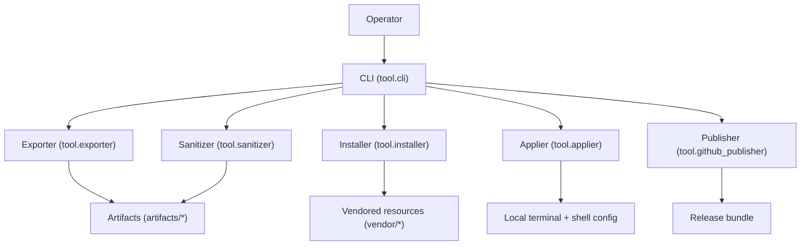

This diagram shows the primary runtime orchestration: the CLI delegates to module-specific pipelines that generate artifacts, optionally modify local configuration, and package releases. Vendored resources are used primarily by the installer path.

Data flow (inputs → processing → storage → outputs):

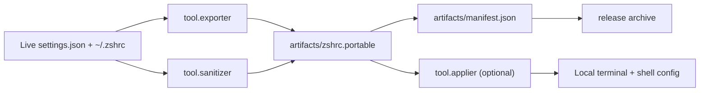

This data-flow view emphasizes the transformation from live user configuration into sanitized artifacts and a manifest, which then feed both local application and release packaging.

Build/deploy pipeline:

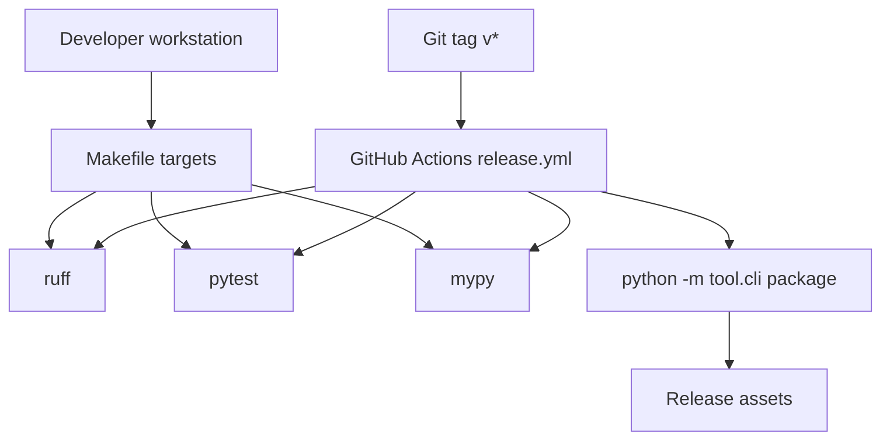

This diagram reflects the observed CI/CD and local build posture: local Makefile targets mirror CI checks, and tagged builds trigger packaging and release.

Mind map: .github

This mind map shows repository automation and GitHub-facing documentation, centered on the release workflow.

Mind map: artifacts

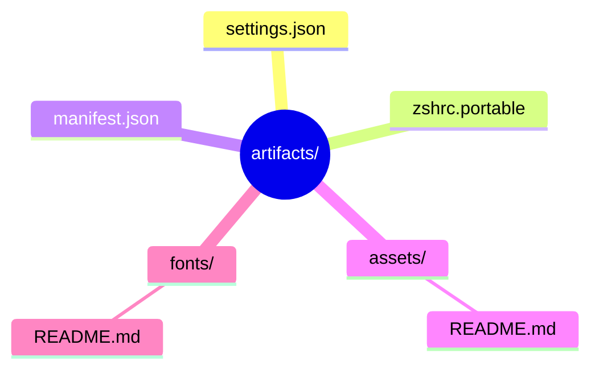

This mind map highlights generated payloads produced by export and sanitize steps, alongside supporting asset/font folders.

Mind map: docs

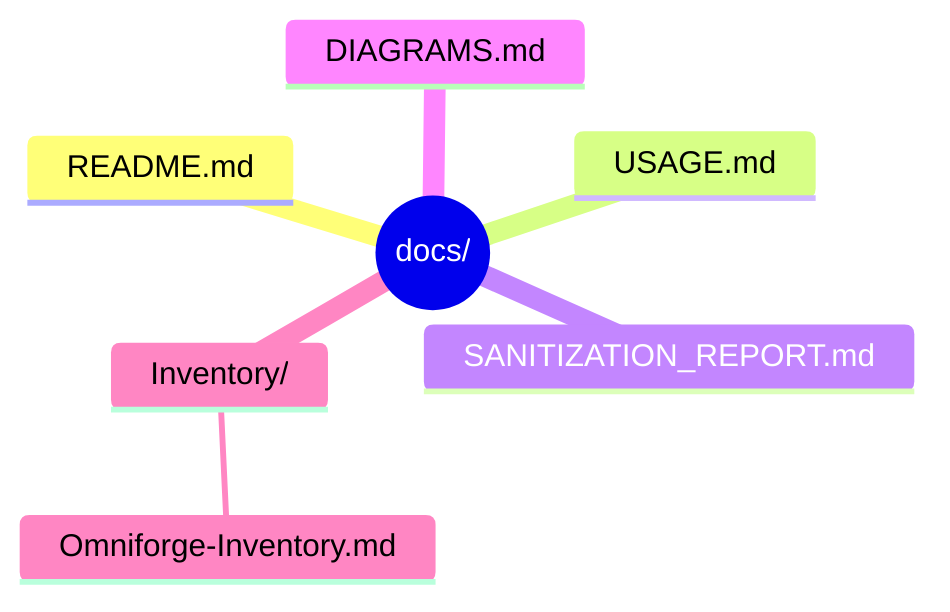

This mind map captures the documentation corpus used by operators and auditors, including the inventory report produced in this audit.

Mind map: image

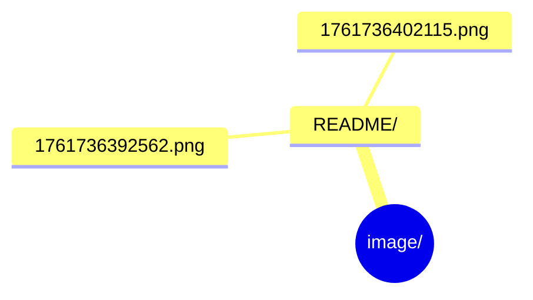

This mind map indicates binary documentation images stored under the image/README directory.

Mind map: scripts

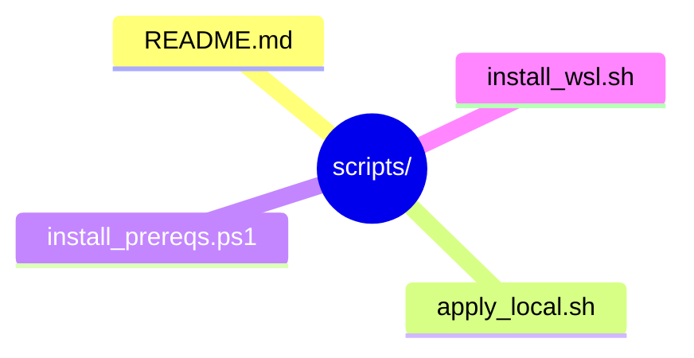

This mind map shows the platform-specific automation scripts that wrap the CLI.

Mind map: tests

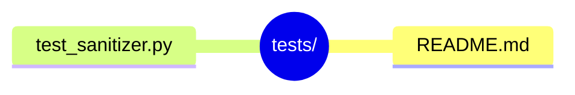

This mind map shows the current test suite focus, primarily on the sanitizer.

Mind map: tmp

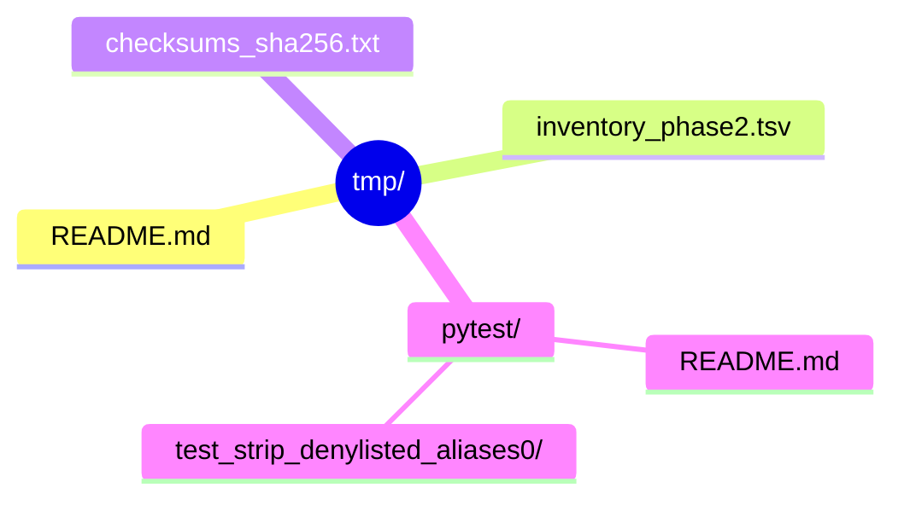

This mind map shows ephemeral outputs, including audit artifacts generated during this process.

Mind map: tool

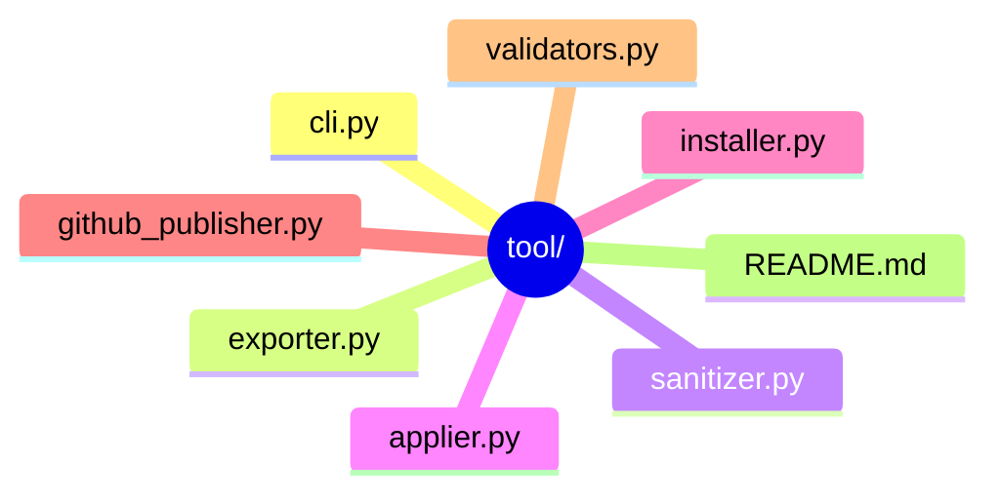

This mind map represents the core Python implementation modules and the CLI entry point.

Mind map: vendor

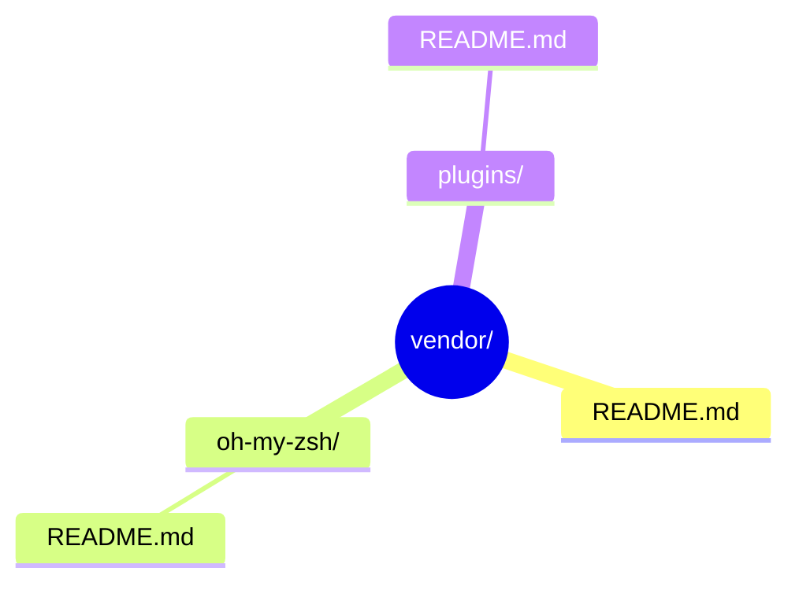

This mind map shows third-party resources kept for offline installation and their associated notes.

Mind map: windows_terminal_portable_profile.egg-info

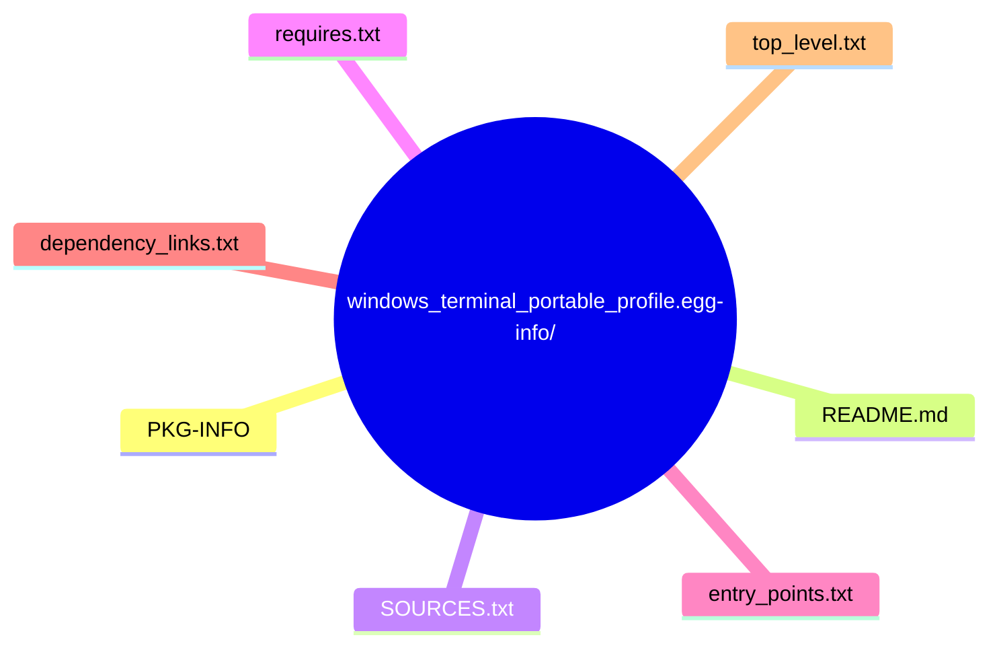

This mind map reflects generated packaging metadata created by setuptools and pip.

## H) Risk register and recommendations

Risk: Vendored dependencies without embedded license files | Evidence: [vendor/oh-my-zsh/README.md](vendor/oh-my-zsh/README.md), [vendor/plugins/README.md](vendor/plugins/README.md) | Severity: High | Likelihood: Medium | Impact: Legal/IP exposure in redistribution | Mitigation: Acquire and include upstream licenses, or replace with clean-room alternatives before handoff.

Risk: Ownership attribution for “Matthew McCloskey” absent in formal metadata | Evidence: No matches in repository search; license and metadata attribute “Runndownn” | Severity: Medium | Likelihood: High | Impact: Ambiguous ownership in IP separation | Mitigation: Counsel-directed updates to ownership markers in authored docs or metadata where appropriate.

Risk: Generated artifacts tracked in repository | Evidence: [artifacts](artifacts), [windows_terminal_portable_profile.egg-info](windows_terminal_portable_profile.egg-info) | Severity: Medium | Likelihood: Medium | Impact: Confusion during clean-room rebuilds, potential propagation of machine-specific data | Mitigation: Document regeneration steps and consider excluding from clean-room baseline.

Risk: Limited test coverage outside sanitizer | Evidence: [tests/test_sanitizer.py](tests/test_sanitizer.py) only | Severity: Low | Likelihood: Medium | Impact: Regression risk in exporter/applier/install workflows | Mitigation: Add tests for exporter, applier, and installer pipelines with fixtures and mocks.

Risk: Operational steps rely on platform-specific tooling (winget, wsl.exe) | Evidence: [scripts/install_prereqs.ps1](scripts/install_prereqs.ps1), [scripts/install_wsl.sh](scripts/install_wsl.sh) | Severity: Medium | Likelihood: Medium | Impact: Onboarding friction in non-Windows environments | Mitigation: Provide explicit platform variants and offline validation steps.

## Backup Branch Snapshot Procedure

### Preconditions

- Verify correct repository path and Git presence using `git rev-parse --show-toplevel`.
- Confirm working tree status and note untracked files with `git status --porcelain=v1`.
- Confirm remote configuration (default `origin`) via `git remote -v`.
- Snapshot source: current working tree (default). If a clean committed state is required, explicitly note that and create a clean checkout before proceeding.

### Exclusion rules (noise control)

- Rely on existing [.gitignore](.gitignore) and add a minimal snapshot-specific exclude list for transient artifacts not already ignored.
- Exclude `.venv/`, `venv/`, `__pycache__/`, `.pytest_cache/`, `.mypy_cache/`, `.ruff_cache/`, `.cache/`, `.ipynb_checkpoints/`, `dist/`, `build/`, `*.pyc`, `release/`, and any local editor workspace files.
- Edge cases: ignore nested venvs, tool-specific caches under tmp/, and OS-specific files (e.g., `.DS_Store`).

### Branch creation and staging procedure

- Identify base commit on the current branch and create `backup/workspace-snapshot-YYYYMMDD` from that point.
- Stage all tracked files and add legitimate untracked operational files (including hidden files like `.github/`) while explicitly excluding transient artifacts and caches.
- Validate that generated caches in tmp/ are not staged unless explicitly required as audit outputs.

### Verification checklist (pass/fail)

- Branch name matches `backup/workspace-snapshot-YYYYMMDD`.
- Base commit matches the observed working branch head.
- Staged contents include tracked project files and required operational dotfiles.
- Exclusions confirmed: no caches, venvs, or build outputs staged.
- No secrets detected in staged diff.

### Commit + push

- Commit message template: `backup: workspace snapshot YYYYMMDD`.
- Push to configured remote (default `origin`) and confirm remote branch creation via `git ls-remote --heads`.

### Safety notes and rollback

- If a file is accidentally staged, use `git restore --staged <path>` to unstage before commit.
- If sensitive material is discovered, stop the process, remove it from staging, and initiate rotation/remediation through approved channels before proceeding.

## Owner attribution sweep

- Required owner name “Matthew McCloskey” not found anywhere in the repository from available evidence.
- Current ownership markers found: [LICENSE](LICENSE) and [pyproject.toml](pyproject.toml) attribute the project to “Runndownn.”
- Action: Counsel review needed to determine if ownership attribution should be added to authored materials (do not add to third-party/vendored content).

## I) Appendices

### I.1 Evidence / Commands Executed (safe redaction)

Commands executed during this audit session (terminal only):
- `git -C /home/apiadmin/Omniforge rev-parse --show-toplevel`
- `git -C /home/apiadmin/Omniforge rev-parse --abbrev-ref HEAD`
- `git -C /home/apiadmin/Omniforge rev-parse HEAD`
- `git -C /home/apiadmin/Omniforge status --porcelain=v1`
- `git -C /home/apiadmin/Omniforge remote -v`
- `date -Iseconds`
- `python3 - <<'PY' ...` (generated tmp/inventory_phase2.tsv from filesystem walk)
- `stat -c '%s %y' /home/apiadmin/Omniforge/tmp/inventory_phase2.tsv`
- `python3 - <<'PY' ...` (generated tmp/checksums_sha256.txt with SHA-256 hashes)
- `stat -c '%s %y' /home/apiadmin/Omniforge/tmp/checksums_sha256.txt`

### I.2 Notable file list (entry points, manifests, infra configs, security-relevant files)

- [tool/cli.py](tool/cli.py) (primary CLI entrypoint)
- [pyproject.toml](pyproject.toml) (project metadata and tooling)
- [requirements.txt](requirements.txt) (runtime dependencies)
- [.github/workflows/release.yml](.github/workflows/release.yml) (CI/CD release pipeline)
- [docs/SANITIZATION_REPORT.md](docs/SANITIZATION_REPORT.md) (sanitization ledger)
- [artifacts/manifest.json](artifacts/manifest.json) (artifact checksums)
- [vendor/README.md](vendor/README.md) (vendored content notes)
- [windows_terminal_portable_profile.egg-info/PKG-INFO](windows_terminal_portable_profile.egg-info/PKG-INFO) (packaging metadata)

### I.3 Unknowns / Needs confirmation

- Upstream licenses for vendored content under [vendor/oh-my-zsh](vendor/oh-my-zsh) and [vendor/plugins](vendor/plugins) are not present in this snapshot. Evidence needed: upstream LICENSE files or recorded attribution in vendor tree.
- Whether documentation images in [image/README](image/README) are authored or third-party. Evidence needed: source attribution or creation records.
