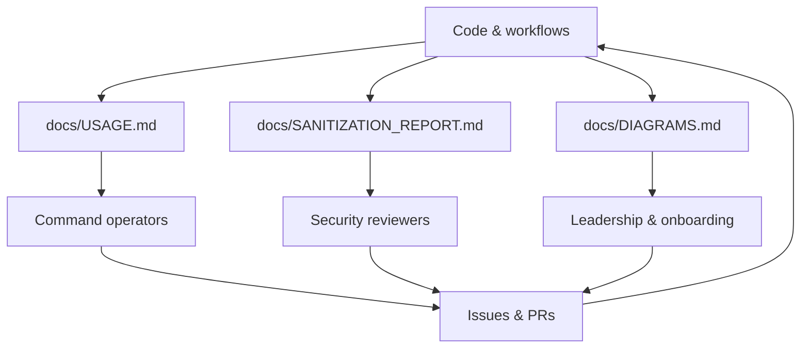

# Documentation Set

The `docs` folder centralizes human-readable guides. Each document is generated or curated alongside code to keep operators and auditors informed.

- `USAGE.md` — step-by-step walkthroughs.
- `SANITIZATION_REPORT.md` — append-only ledger of every scrubbed artifact.
- `DIAGRAMS.md` — canonical architecture visualizations used in presentations.

Each document is maintained alongside the code that produces the behavior it describes:

- `USAGE.md` mirrors the Typer commands declared in `tool/cli.py`.
- `SANITIZATION_REPORT.md` is updated by `_append_log_entry` in `tool/sanitizer.py` whenever the sanitizer runs successfully.
- `DIAGRAMS.md` contains manually curated Mermaid diagrams; keep it consistent with `tool/README.md` when adding new modules.

For deeper architecture notes, pair this README with `tool/README.md` and the generated Mermaid diagrams referenced above.

## How to Update Documentation

1. Execute `python -m tool.cli diagnostics` after major changes and capture the results in `docs/USAGE.md` when needed.
2. When adding sanitization rules, append a rationale to `docs/SANITIZATION_REPORT.md` to preserve audit history.
3. Use `make diagrams` (or regenerate manually) to refresh Mermaid diagrams before publishing.
