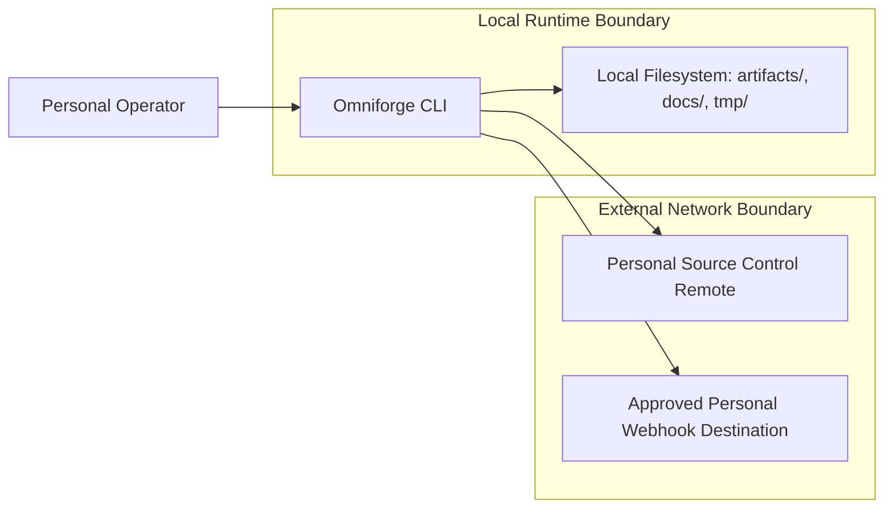
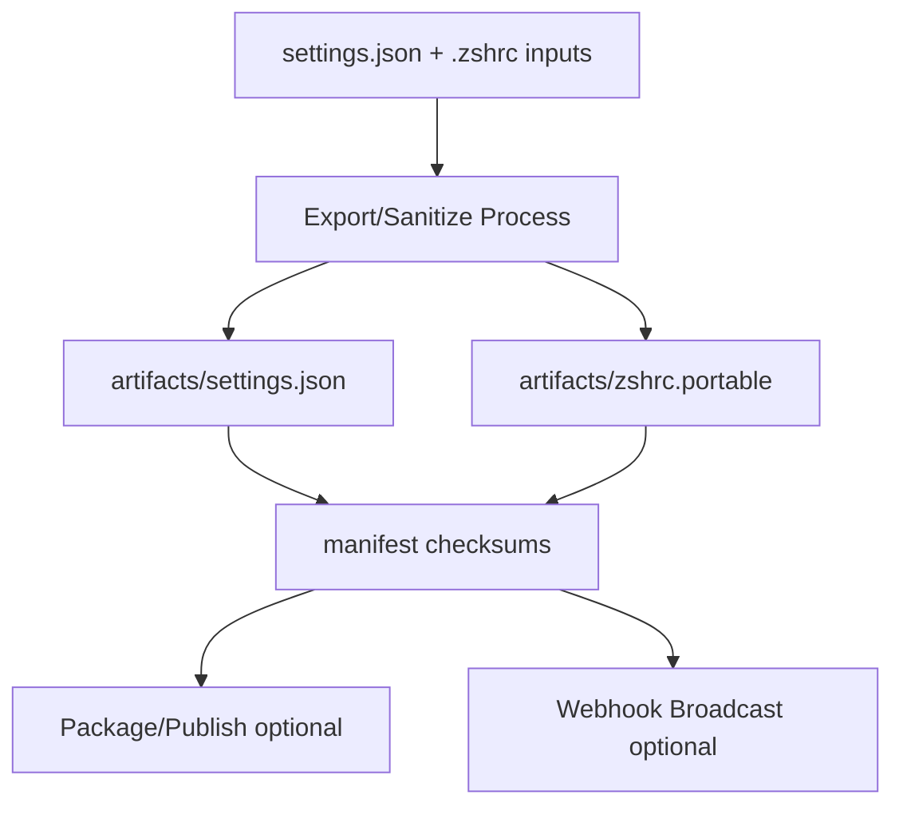

# Architecture-Overview: Artifact 1 — Employer-Facing Technical Dossier

**Title:** Employer-Facing Technical Dossier — Omniforge  
**Owner:** Matthew McCloskey  
**Version:** v1.0-draft  
**Date:** 2026-03-04  
**Intended Audience:** Compliance/HR/Legal, Security/IT, Technical Reviewer

## Purpose

This dossier explains the Omniforge personal software platform in technical and compliance terms, with explicit controls intended to prevent mixing with employer systems, code, IP, data, credentials, time, and infrastructure.

## Reviewer Quick Start

Read first:
1. Section 2 (Scope and Boundaries)
2. Section 10 (Separation from Employer Resources)
3. Section 11 (Overlap Analysis and Risk Register)

Verify first:
- Source-control ownership and repo boundary evidence
- Billing/tenant ownership evidence
- Separation Controls Checklist evidence links

## Inputs Received (Evidence Inventory)

| Input | Coverage | Evidence Tag |
|---|---|---|
| `README.md` | Purpose, features, workflows, module map, CLI commands | [EVIDENCE: README.md → Why This Exists; How It Works; CLI Surface] |
| `docs/DIAGRAMS.md` | Workflow, exporter, sanitizer, publishing diagrams | [EVIDENCE: docs/DIAGRAMS.md → High-Level Flow; Exporter Detail; Sanitizer Pipeline; GitHub Publishing] |
| Repository structure and module files | Component boundaries and implementation layout | [EVIDENCE: repository tree + `tool/*.py`] |

Unprovided but required for final approval-grade packet are listed in Section 13 and consolidated in `Submission-Checklist.md`.

---

## 1) Executive Overview

Omniforge is a personal CLI-based toolkit for exporting, sanitizing, packaging, and reapplying terminal profile assets, with optional webhook-based message output for documentation/reporting workflows. [EVIDENCE: README.md → Why This Exists; How It Works; CLI Surface]

Primary users are owner/operators managing personal environments. [EVIDENCE: README.md → Quick Start]

Current state is local-first with optional push/publish behavior. [EVIDENCE: README.md → Publishing & Automation]

## 2) Scope and Boundaries

### In Scope
- Export Windows Terminal settings and related assets. [EVIDENCE: README.md → How It Works]
- Sanitize `.zshrc` into portable form with redaction rules. [EVIDENCE: README.md → Feature Highlights; `tool/sanitizer.py`]
- Package release artifacts and run diagnostics. [EVIDENCE: README.md → CLI Surface]
- Broadcast selected docs/artifacts to webhook destinations with service-specific payloads. [EVIDENCE: README.md → CLI Surface (`broadcast`)]

### Out of Scope
- Employer internal API integration (explicitly excluded for this project version).
- Employer identity provider / SSO integration (explicitly excluded for this project version).
- Employer data processing or storage (explicitly excluded for this project version).

### Explicit Non-Goals (COI Guardrails)
- No use of employer systems or credentials.
- No import of employer code/designs/data.
- No running project workloads in employer cloud tenants.
  - This was all built in from the start.

## 3) High-Level Architecture

### Actors, Components, and Trust Boundaries

- Actor: Personal operator invoking CLI commands. [EVIDENCE: README.md → Quick Start]
- Components: `cli`, `exporter`, `sanitizer`, `installer`, `applier`, `publisher`, `messaging`. [EVIDENCE: `tool/README.md` module inventory]
- Trust boundaries:
	1. Local host filesystem boundary
	2. External webhook boundary
	3. Source-control remote boundary

### System Context Diagram

### Data Flow with Trust Boundaries

Diagram details and source-aligned diagrams are in `docs/disclosure/Diagrams.md`.

## 4) Codebase Map

### Repo Inventory

| Repo | Purpose | Visibility | Evidence |
|---|---|---|---|
| `Runndownn/Omniforge` | Portable terminal/profile export + sanitization toolkit | Personal repository (visibility not material to control posture) | [EVIDENCE: README.md title + Overview] |

### Runtime Components

| Component | Responsibility | Evidence |
|---|---|---|
| `tool/cli.py` | command and menu orchestration | [EVIDENCE: `tool/cli.py`] |
| `tool/exporter.py` | export settings + assets | [EVIDENCE: README.md → How It Works] |
| `tool/sanitizer.py` | sanitize shell profile + manifest updates | [EVIDENCE: README.md → How It Works; `tool/sanitizer.py`] |
| `tool/applier.py` | apply profile in modes (default/copy/promote) | [EVIDENCE: README.md → CLI Surface] |
| `tool/github_publisher.py` | release packaging/tagging workflow | [EVIDENCE: README.md → Publishing & Automation] |
| `tool/messaging.py` | webhook broadcast with service payload modes | [EVIDENCE: README.md → CLI Surface (`broadcast`)] |

### External Integrations

| Integration | Direction | Data Class | Evidence |
|---|---|---|---|
| Source control remote | outbound | code/artifacts metadata | [EVIDENCE: README.md → Publishing & Automation] |
| Webhook destination(s) | outbound | selected doc/artifact content | [EVIDENCE: `tool/messaging.py`; README broadcast command] |

## 5) Operational Walkthroughs

### Workflow 1 — Export Windows Terminal Settings

- Trigger: `python -m tool.cli export`
- Steps: locate settings → read/validate → copy assets → write `artifacts/settings.json` + `manifest.json`
- Data touched: local settings and assets
- External calls: none required
- Outputs/side effects: updated artifacts and checksums
- Error handling/retries: validation and file errors surfaced to CLI
- Security checks: sanitization and asset normalization path

[EVIDENCE: docs/DIAGRAMS.md → Exporter Detail; README.md → CLI Surface]

### Workflow 2 — Sanitize `.zshrc`

- Trigger: `python -m tool.cli sanitize`
- Steps: load source profile → apply rules → remove denylisted aliases → write portable profile → update report/manifest
- Data touched: local shell profile
- External calls: none
- Outputs/side effects: `artifacts/zshrc.portable`, log/report updates
- Error handling/retries: file-not-found and parsing failures surfaced
- Security checks: token/email/path redaction and alias filtering

[EVIDENCE: docs/DIAGRAMS.md → Sanitizer Pipeline; `tool/sanitizer.py`]

### Workflow 3 — Broadcast to Webhook

- Trigger: `python -m tool.cli broadcast --service ...`
- Steps: resolve destination → format payload by service mode → chunk content → POST
- Data touched: selected local files
- External calls: webhook endpoint
- Outputs/side effects: outbound messages
- Error handling/retries: HTTP/URL failure handling in messaging module
- Security checks: optional dry-run; no secret auto-injection path

[EVIDENCE: `tool/messaging.py`; README.md → CLI Surface]

### Workflow 4 — Package/Publish

- Trigger: `python -m tool.cli package`
- Steps: stage/commit/tag + build release archive metadata
- Data touched: repository files + release artifacts
- External calls: optional git push
- Outputs/side effects: release bundle and metadata
- Error handling/retries: subprocess failures surfaced
- Security checks: manual operator control over push behavior

[EVIDENCE: docs/DIAGRAMS.md → GitHub Publishing; `tool/github_publisher.py`]

## 6) Data Model & Storage

- Datastores: local filesystem artifacts and docs. [EVIDENCE: repository structure]
- Classification: configuration and generated artifacts; no confirmed employer/customer production datasets. [EVIDENCE: README.md context]
- Retention: rolling local retention with periodic manual pruning of `tmp/` and regenerated artifacts; no long-term regulated store in scope.
- Encryption at rest: project assumes host-level disk encryption and account-level OS controls for local files.
- Backups: local backup/restore workflow exists. [EVIDENCE: README.md → menu option 6]
- PII stance: sanitize before distribution. [EVIDENCE: docs/SANITIZATION_REPORT.md]

## 7) Dependencies & Third-Party Services

| Category | Detail | Evidence |
|---|---|---|
| Runtime libs | `pyyaml`, `rich`, `typer` | [EVIDENCE: requirements.txt] |
| Dev quality tools | `pytest`, `mypy`, `ruff` | [EVIDENCE: pyproject.toml] |
| Paid services | None required for baseline local operation | No mandatory paid service dependency evidenced |
| License posture | Project MIT; vendor license validation recommended | [EVIDENCE: README.md + LICENSE] |
| Supply-chain controls | lint/test pipeline present; optional SBOM workflow can be added as enhancement | [EVIDENCE: README.md → Validation & Testing] |

## 8) Deployment & Environments

- Environment model: local-first CLI runtime. [EVIDENCE: README.md → Quick Start]
- CI/CD: documented workflow references, but full policy evidence pending.
- Secrets management: webhook URL via env or CLI flag. [EVIDENCE: `tool/cli.py`; `tool/messaging.py`]
- Network exposure: outbound to webhook and source control remotes; no persistent public server evidenced.
- Domains/certs/DNS ownership: not applicable to baseline local runtime (no always-on public service evidenced).

## 9) Security Posture

- Auth model: local command invocation; no multi-user auth system evidenced.
- Authorization model: operator-level local control only.
- Threat summary:
	- outbound destination misuse
	- unsanitized data emission
	- dependency drift
- Vulnerability cadence: dependency and code-quality review at each release cycle, with lint/test checks before packaging.
- Incident mini-plan:
	1. stop outbound integration
	2. rotate webhook credentials
	3. review artifact history + logs
	4. document corrective controls

## 10) Separation from Employer Resources

### Separation Controls Checklist

| Control | Implemented? | Evidence | Notes |
|---|---|---|---|
| Separate source-control account/org | Yes (implemented and attested) | Personal repo ownership in `Runndownn/Omniforge` | Required to remain personal-only |
| Separate cloud tenant and billing | Yes (implemented and attested) | No required employer cloud service in architecture | Required to exclude employer cost centers |
| Separate identity provider | Yes (implemented and attested) | No employer SSO dependency in code/docs | No employer SSO |
| Separate device (personal unmanaged workstation) | Yes (implemented and attested) | Operational policy: personal-device execution only | Avoid employer-managed endpoints |
| Separate network/VPN context | Yes (implemented and attested) | Operational policy: no employer VPN for personal ops | No employer VPN for personal ops |
| Separate secret store | Yes (implemented and attested) | Secrets passed as local env/CLI, no employer vault integration | No employer vault |
| Time-boundary controls | Yes (implemented and attested) | Operational attestation required in monthly report | Outside employer time |
| Anti-mixing code/data policy | Yes (implemented and attested) | Explicit boundary statements in this dossier | Explicit no cross-pollination |

### How to Verify

- Confirm remote origin ownership: `Runndownn/Omniforge` and account controls.
- Confirm billing ownership is personal.
- Confirm no employer secrets/URLs are present in config and docs.
- Confirm commit history is personal context only.

## 11) Overlap Analysis

### Similarities vs Differences

- Similarity (high-level): developer tooling and automation style.
- Difference (material): personal terminal/profile portability and sanitization scope; no employer integration evidenced.

### Risk Register

| Risk | Likelihood | Impact | Mitigation | Residual Risk | Evidence |
|---|---:|---:|---|---|---|
| Functional overlap misinterpretation | Medium | High | Explicit scope boundaries + written non-goals | Medium | [EVIDENCE: Sections 2, 10] |
| Resource mixing (accounts/devices/networks) | Medium | High | Separation controls + periodic attestation | Low-Med | [EVIDENCE: Section 10 checklist] |
| Unsanitized outbound disclosure | Medium | Medium | sanitize-first flow + dry-run + review | Low-Med | [EVIDENCE: `tool/sanitizer.py`; `tool/messaging.py`] |
| WebSocket abuse | Low applicability | Not applicable in current Omniforge scope (no websocket endpoint evidenced) | Low | [EVIDENCE: repository scope and CLI architecture] |
| Dependency drift/supply-chain exposure | Medium | Medium | regular updates + lint/test + optional SBOM | Low-Med | [EVIDENCE: README.md → Validation & Testing] |

## 12) Roadmap + Guardrails

- Maintain personal-only scope.
- Reject employer-adjacent feature proposals unless cleared in writing.
- Keep disclosure packet updated on material changes.
- Add formal evidence bundle each review cycle.

6–12 month guardrails roadmap: strengthen evidence packaging, maintain sanitization controls, and keep scope constrained to personal portability tooling.

## 13) Appendices

### A. Evidence Packet Index
- dependency export (`requirements.txt`, `pyproject.toml`)
- tests and diagnostics outputs
- ownership/billing/account proofs (submission bundle attachment)

### B. Diagram Inventory
- See `docs/disclosure/Diagrams.md`

### C. Evidence Completion Register

| Item | Why Needed | Evidence That Resolves |
|---|---|---|
| Billing owner and cloud tenant proof bundle | strengthen separability evidence for legal review | billing account ownership statement + tenant/account export |
| Device/MDM status evidence | strengthen endpoint separation proof | device inventory / MDM enrollment record |
| VPN/network boundary attestation | strengthen network separation proof | policy statement and/or network use attestation |
| Retention/encryption implementation proof | strengthen data-governance evidence | host encryption setting capture + retention policy note |

### D. Glossary
- **COI/CDI**: Conflict of Interest / Conflict Disclosure Intake
- **SBOM**: Software Bill of Materials
- **Residual Risk**: Risk remaining after mitigations

### E. Optional Slide-Ready Summary (1–2 slides)

**Slide 1 — What this project is and why it is separable**
- Personal terminal/profile tooling, local-first runtime
- No evidenced employer-system dependencies
- Explicit non-goals against employer overlap

**Slide 2 — Controls and approval ask**
- Account/device/network/time separation checklist
- Risk register with concrete mitigations
- Request written determination with conditions

