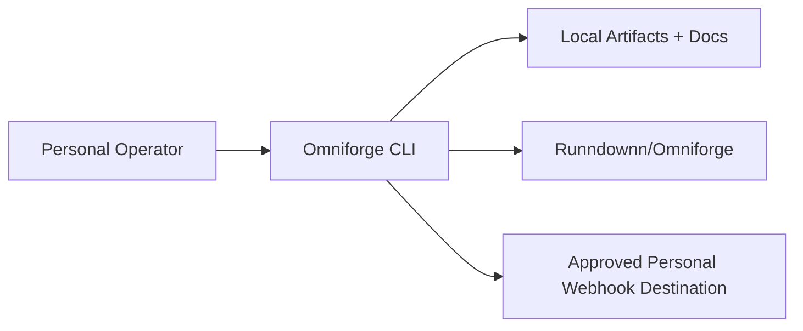
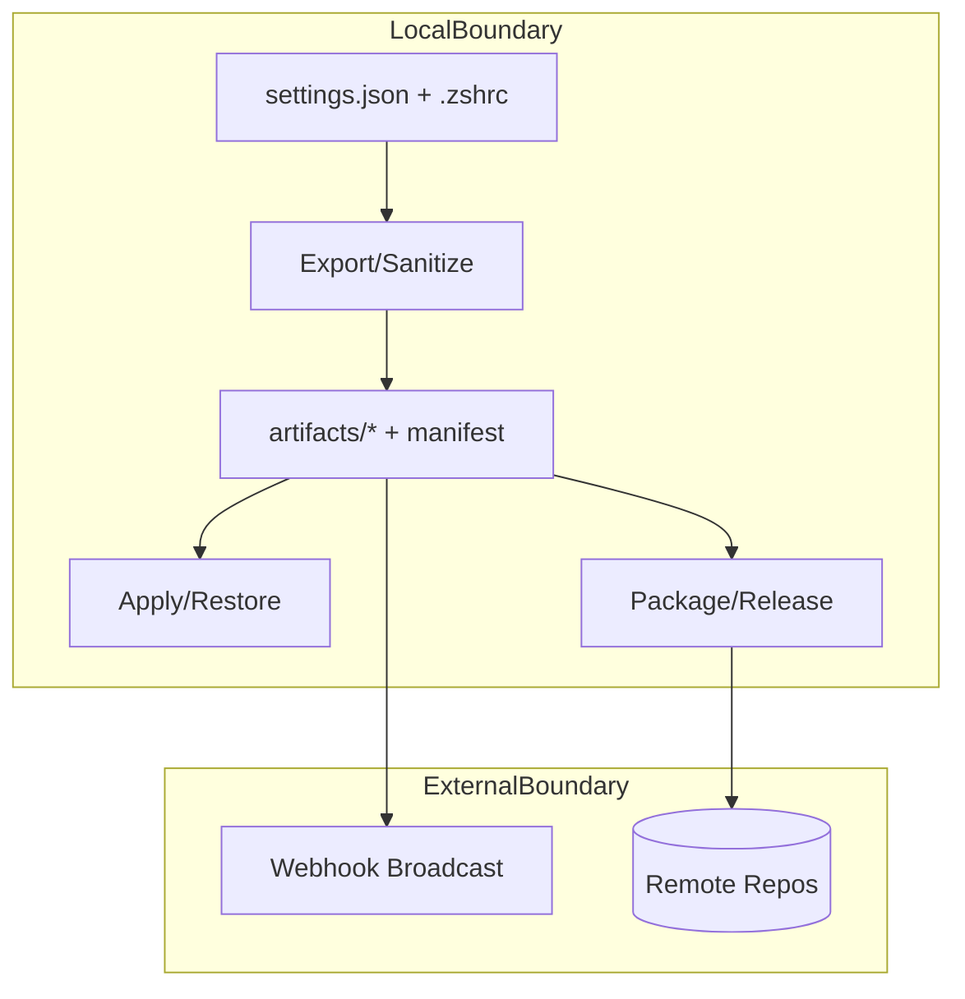
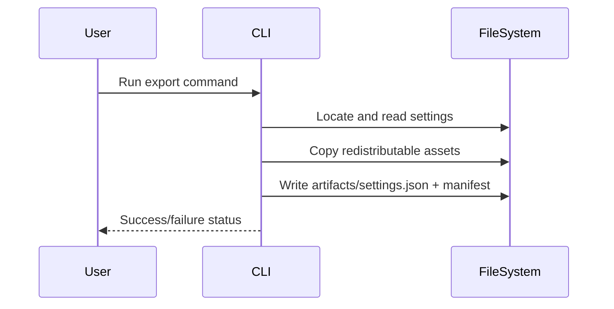
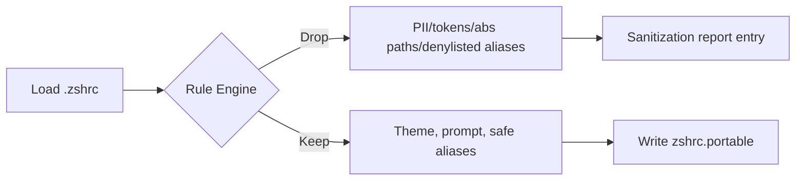
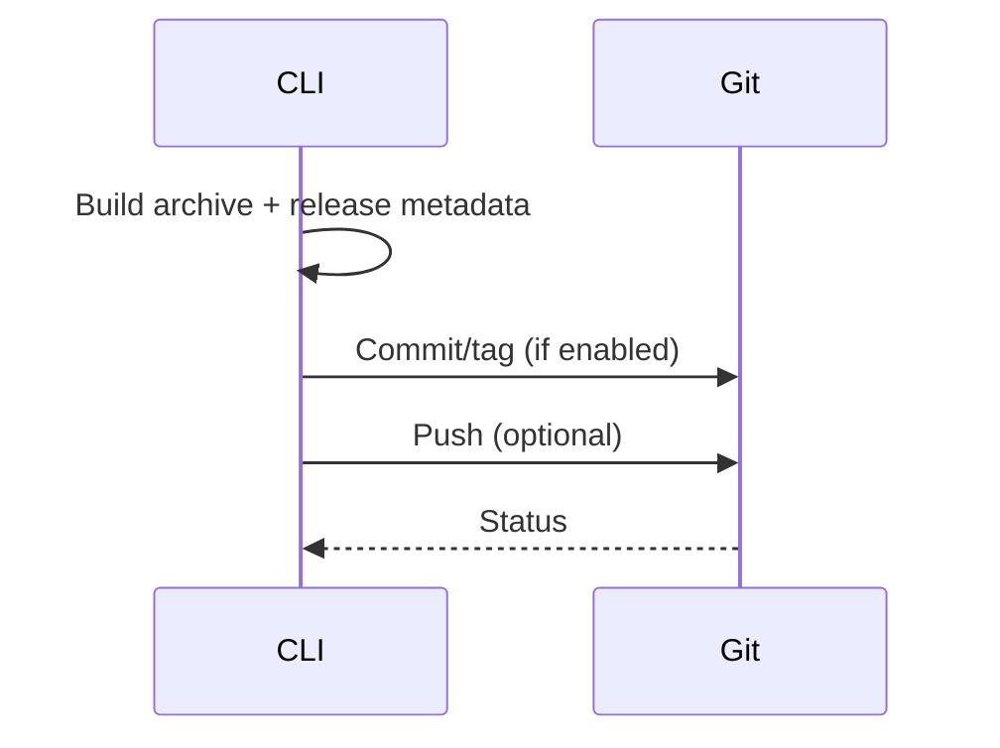
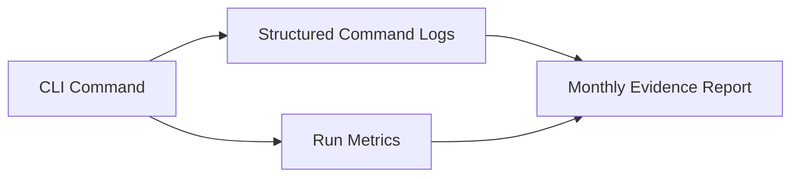
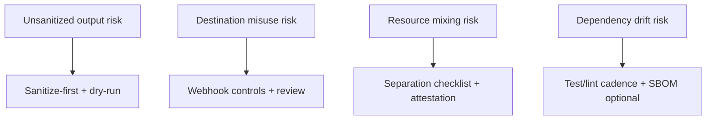

# Disclosure Diagram Pack

**Title:** Disclosure Diagram Pack — Omniforge  
**Owner:** Matthew McCloskey  
**Version:** v1.0-draft  
**Date:** 2026-03-04  
**Intended Audience:** Security/IT, Legal/Compliance, Technical Reviewer

## Purpose

This document centralizes visual evidence for architecture, trust boundaries, and operational flows used in COI/CDI review.

## Reviewer Quick Start

Read first:
1. System Context
2. Trust-Boundary Data Flow
3. Top Workflow Sequences

Verify:
- Diagram steps align with CLI commands and module behavior
- External boundaries are explicitly shown

## Inputs Received

- Baseline diagrams: [EVIDENCE: docs/DIAGRAMS.md]
- Workflow and component definitions: [EVIDENCE: README.md → How It Works; CLI Surface]

---

## Diagram Index

| # | Diagram | Purpose | Evidence Anchor |
|---|---|---|---|
| 1 | System Context | Show actors + external boundaries | [EVIDENCE: README.md; docs/DIAGRAMS.md] |
| 2 | Trust-Boundary Data Flow | Show local vs external flow crossing | [EVIDENCE: docs/DIAGRAMS.md → High-Level Flow] |
| 3 | Export Workflow Sequence | Verify export lifecycle | [EVIDENCE: docs/DIAGRAMS.md → Exporter Detail] |
| 4 | Sanitizer Pipeline | Verify sanitization controls | [EVIDENCE: docs/DIAGRAMS.md → Sanitizer Pipeline] |
| 5 | Publish Workflow Sequence | Verify release path | [EVIDENCE: docs/DIAGRAMS.md → GitHub Publishing] |
| 6 | Telemetry Pipeline (current + future target) | Observability model for compliance reports | Current state uses local command-level telemetry; centralized backend remains a future control enhancement |
| 7 | Lightweight Threat View | Communicate top risk surfaces | [EVIDENCE: Architecture-Overview.md risk section] |

---

## 1) System Context

## 2) Trust-Boundary Data Flow

## 3) Export Workflow Sequence

## 4) Sanitizer Pipeline

## 5) Publish Workflow Sequence

## 6) Telemetry Pipeline (Current + Future Target)

Current documented state: centralized telemetry storage/dashboard tooling is not yet implemented for this project scope.

## 7) Lightweight Threat Model View

