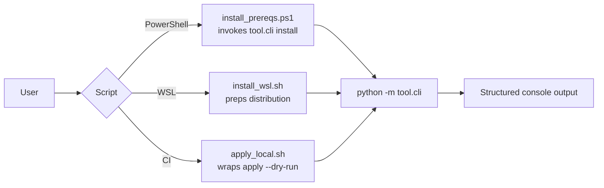

# Utility Scripts

Shell helpers in this directory wrap cross-platform setup flows so the toolkit can be bootstrapped without typing lengthy commands.

- `install_prereqs.ps1` — wraps `python -m tool.cli install --include-wsl` and logs to PowerShell; it also sets `PIP_CACHE_DIR` so packages reuse the Geezer cache.
- `install_wsl.sh` — ensures a WSL distribution is available, installs required packages, and invokes `tool.cli install --non-interactive` when running from Linux hosts.
- `apply_local.sh` — calls `tool.cli apply --dry-run` to validate manifests during CI and can flip to real mode by exporting `APPLY_DRY_RUN=false`.

These scripts are thin shims; the canonical logic still lives in the Python modules described in `tool/README.md`.

## Extending the Script Set

1. Prefer calling Typer commands rather than reimplementing logic in shell.
2. When adding a script, document the environment variables it consumes and update this README with a new diagram node.
3. Keep scripts idempotent—rerunning them should not corrupt artifacts or live settings.
