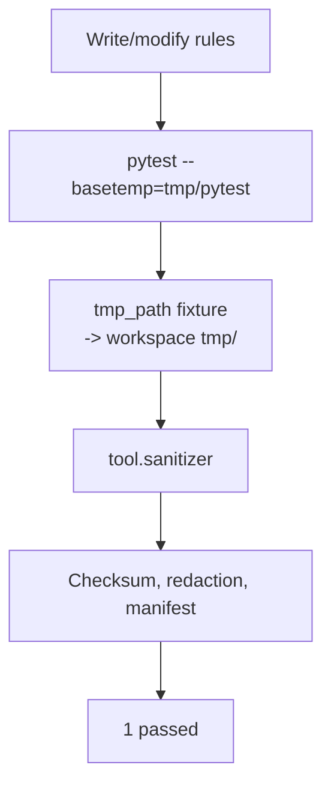

# Test Suite

Tests keep the sanitization pipeline honest and ensure future refactors do not reintroduce sensitive output.

- `test_sanitizer.py` exercises rule application, denylist trimming, manifest bookkeeping, and the UTC timestamp helpers used in the sanitizer.
- Pytest configuration in `pyproject.toml` pins cache directories to `tmp/pytest_cache` for Windows compatibility and adds `pythonpath = ["."]` so the package resolves without installation.

Extend coverage by mirroring real export/apply flows with additional fixtures that mock filesystem layouts.

## Adding New Tests

1. Use the built-in `tmp_path` fixture to isolate filesystem changes. Create realistic `settings.json` or `.zshrc` fixtures under `tmp` to mimic user data.
2. Import helpers directly from `tool.*` modules; they are designed to run without side effects when provided with fake paths.
3. Update this README with new diagrams or flow descriptions as the suite grows (e.g., once exporter tests land).
