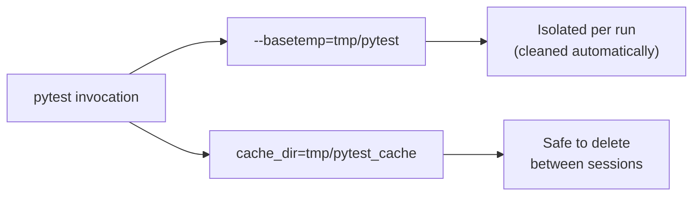

# Temporary Workspace

The `tmp` directory stores disposable runtime data so reproducible artifacts and caches stay out of user profiles. All test and cache commands in this repository write here instead of `AppData\Local\Temp`.

Current subdirectories:

- `pytest/` — forced `--basetemp` for pytest to avoid Windows temp ACL issues.
- `pytest_cache/` — pytest cache redirected via `pyproject.toml`.

Feel free to wipe this folder before or after test runs; all tooling recreates the structure when needed.

## Related Configuration

- See `pyproject.toml` for `--basetemp`/`cache_dir` defaults.
- The CI pipeline automatically prunes this folder in `scripts/apply_local.sh`, guaranteeing clean runs.
