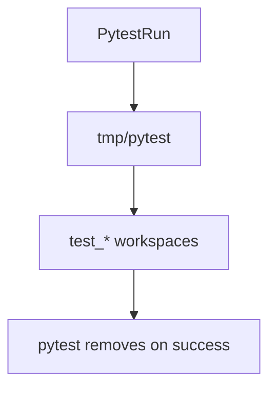

# Pytest Base Temp

This directory is created automatically when pytest runs with `--basetemp=tmp/pytest`. Each test receives its own numbered subdirectory (see `pytest tmp_path factory`), letting `tool.sanitizer` operate on real files without touching your home folder.

Leave the structure intact if tests are executing; pytest manages cleanup lifecycle.

## When to Inspect

- Review the generated files under this folder when debugging sanitization regressions; they show the exact inputs passed to `sanitize_zshrc`.
- If a test fails mid-run, pytest keeps the directory so you can diff artifacts against expectations. Delete it manually after investigation.
