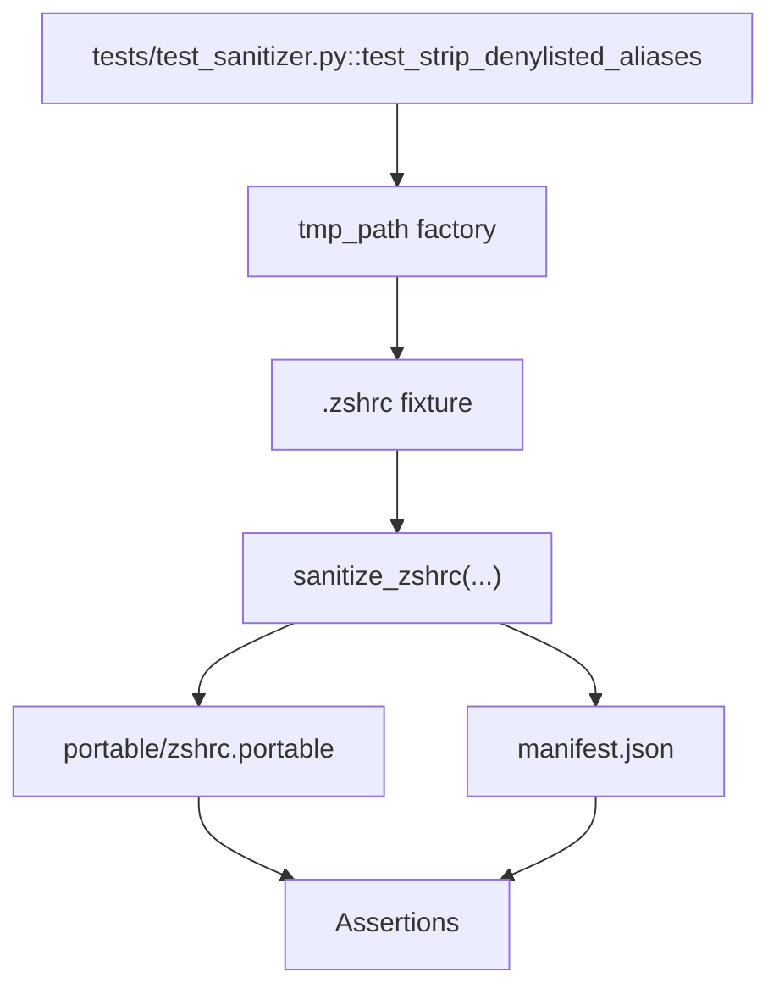

# Test Fixture Workspace

Pytest materializes this directory while running `test_strip_denylisted_aliases`. The fixture mirrors the sanitizer output so assertions can inspect real files without touching your home directory.

Delete this directory whenever you want to reclaim disk space; pytest recreates it on the next run.
