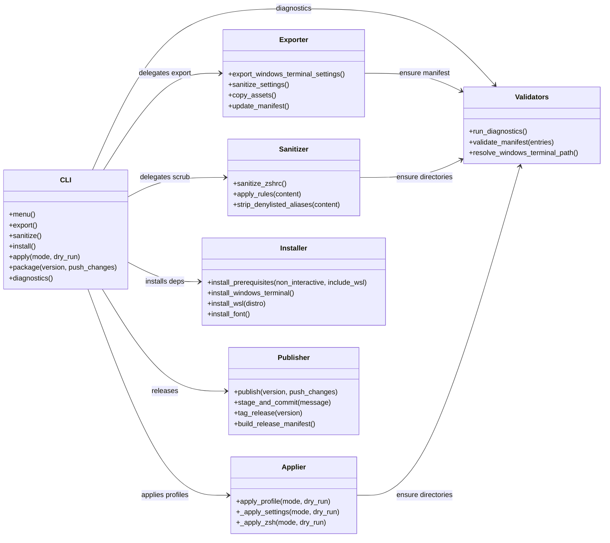
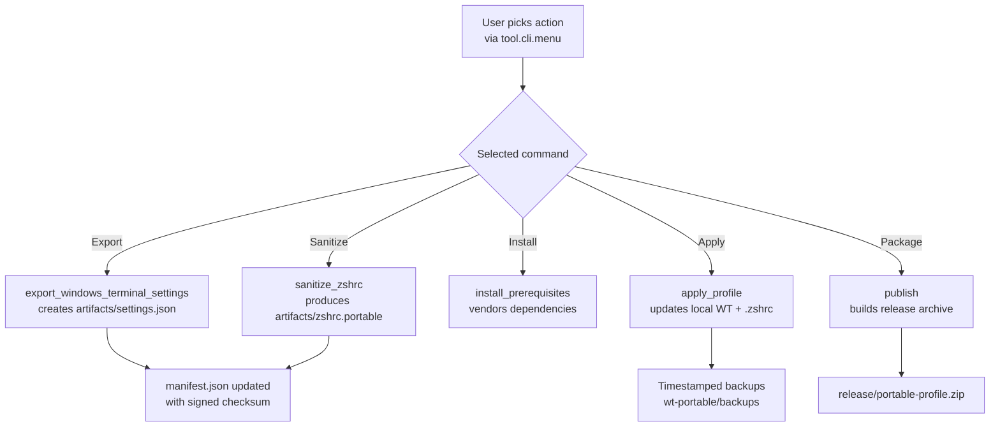

# Tool Package

The `tool` package holds the production code paths that power the portable profile workflow. Each module isolates one responsibility so the CLI can orchestrate complex tasks while remaining easy to audit and test.

## Module Inventory

- `cli.py` builds the Typer entrypoint and interactive menu.
- `exporter.py` lifts Windows Terminal settings and copies any referenced assets.
- `sanitizer.py` normalizes `.zshrc`, removes sensitive material, and maintains the manifest.
- `applier.py` writes sanitized profiles back to disk with safe backups.
- `installer.py` installs optional prerequisites such as WSL and Oh My Zsh.
- `github_publisher.py` prepares Git release artifacts, tags, and pushes.
- `validators.py` provides shared environment and manifest checks.

## Runtime Flow

## Testing Notes

- Functions are designed to be called directly from tests (see `tests/test_sanitizer.py`).
- Pure helpers accept simple inputs (e.g., raw strings or `Path` objects) so they can be fuzzed without disk access.
- Safety checks guard destructive operations with explicit backups and dry-run modes.

## Configuration Touchpoints

- Global settings live in `pyproject.toml` and `Makefile`; both map directly to Typer commands exposed in `cli.py`.
- Environment detection and safeguards are handled in `validators.py` so other modules remain unaware of platform-specific quirks.
- Feature flags or future toggles should be centralized in `validators` or dedicated config modules to keep the CLI thin.
