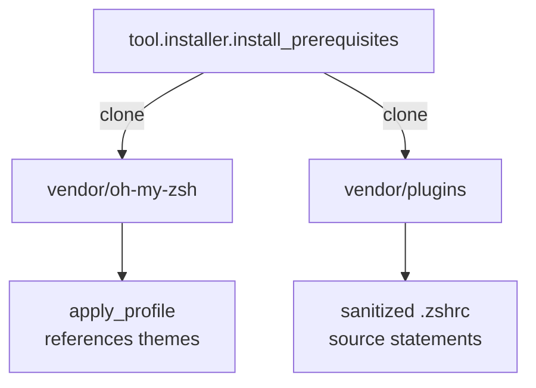

# Vendor Resources

The `vendor` tree contains third-party assets that the installer fetches or manages. Keeping them versioned improves reproducibility while signaling license obligations.

- `oh-my-zsh/` — optional copy of Oh My Zsh used when `install_prerequisites` runs offline.
- `plugins/` — Git clones of syntax-highlighting and autosuggestion plugins.

When updating upstream versions:

1. Pull fresh tags into the respective subdirectory.
2. Record license changes if any.
3. Regenerate portable artifacts to capture new plugin behavior.
4. Re-run `python -m tool.cli sanitize` and `python -m pytest` to verify that new upstream content still passes sanitization and that the denylist remains effective.
