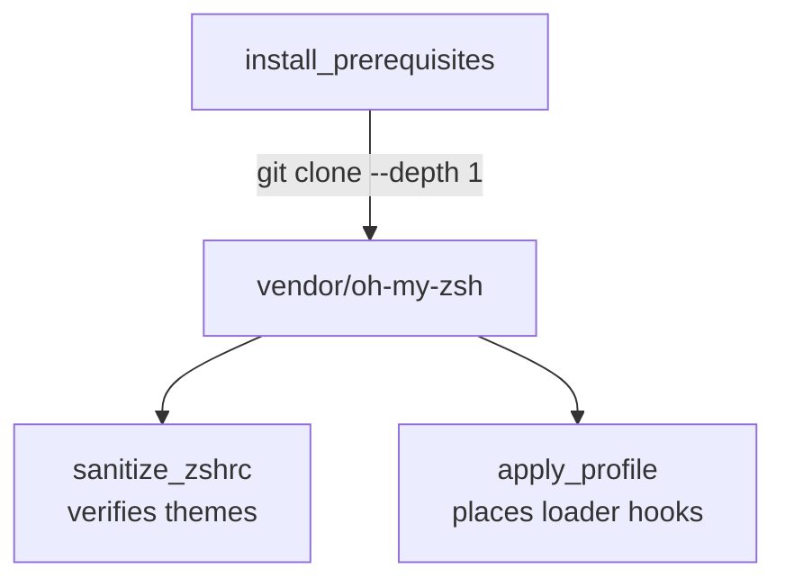

# Oh My Zsh Snapshot

This directory mirrors a shallow clone of [ohmyzsh/ohmyzsh](https://github.com/ohmyzsh/ohmyzsh). The toolkit vendors it so offline installations can provision themes and plugins without an immediate internet connection.

Guidelines:

1. Do not edit upstream files manually; pull updates from the official repository.
2. Check upstream license notes when upgrading.
3. Regenerate sanitized artifacts after updating to ensure compatibility.
4. If new themes or plugins are required, update `tool/sanitizer.py` to permit or deny their aliases accordingly.
