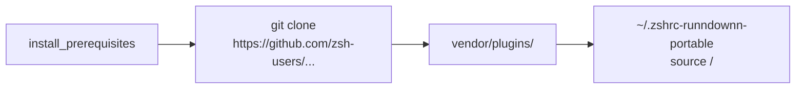

# Zsh Plugins

This folder hosts vendored Oh My Zsh plugins so sanitized profiles can source them without hitting the network.

If you add new plugins:

1. Clone into this directory with `--depth 1` to keep history small.
2. Update the denylist and sanitization rules if the plugin introduces sensitive defaults.
3. Regenerate `artifacts/zshrc.portable` so the loader lines stay in sync.
4. Add plugin-specific checks to `tests/test_sanitizer.py` when the plugin modifies aliases or environment variables.
