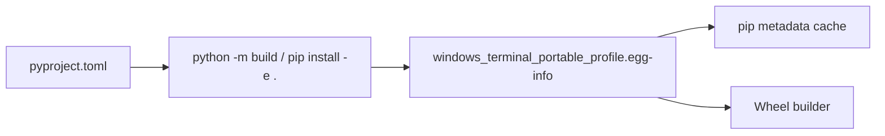

# Packaging Metadata

This folder is produced by `pip install -e .` and records state required by setuptools when building wheels or running editable installs.

Contents:

- `PKG-INFO` — canonical project metadata snapshot.
- `SOURCES.txt` — file manifest for packaging.
- `requires.txt` — runtime requirements list.
- `entry_points.txt` — console scripts registered for installation.

Avoid hand-editing these files; regenerate them by reinstalling the package after source changes.

## Regeneration Workflow

1. Remove the directory: `rm -rf windows_terminal_portable_profile.egg-info`.
2. Run `pip install -e .` (or `python -m build`) to recreate the metadata.
3. Verify `entry_points.txt` still exposes `wt-portable = tool.cli:main`.
